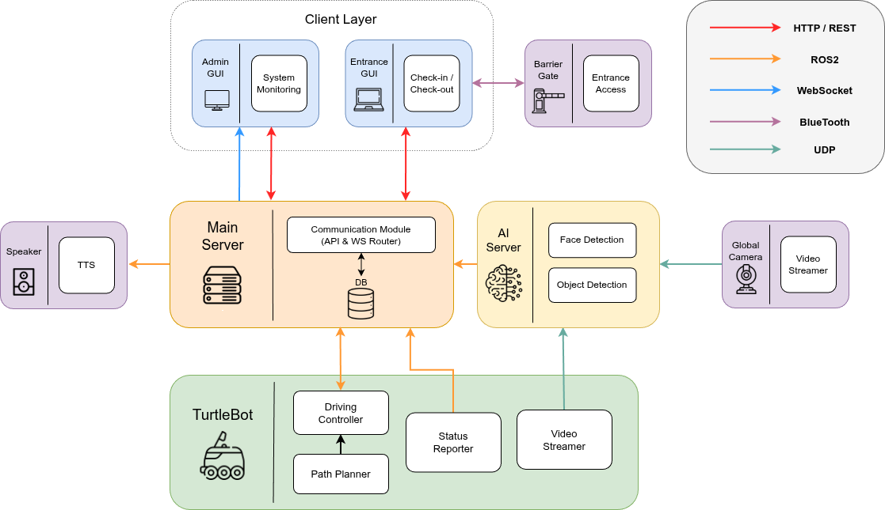
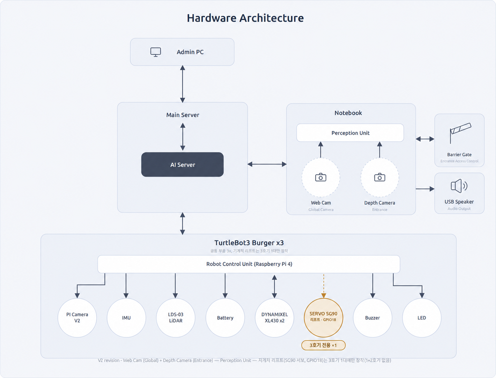
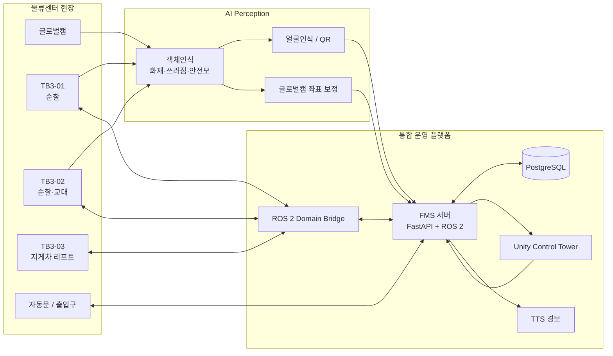
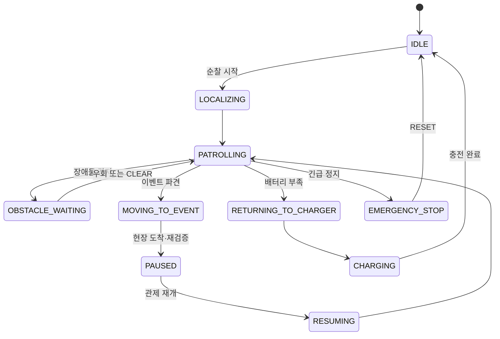

# 🤖 AI 기반 물류센터 안전·인력관리 자율주행 로봇 시스템

> **반복 순찰은 로봇이 맡고, 판단은 AI가 돕고, 모든 상태는 관제에서 추적합니다.**

TurtleBot3 기반 다중 로봇이 물류센터를 자율 순찰하며, 글로벌캠과 로봇 카메라 AI로 위험 상황을 감지하고, 통합 관제에서 대응하는 스마트 팩토리 프로젝트입니다.

## 시스템 아키텍처

### 소프트웨어 아키텍처

<p align="center">
  
</p>

### 하드웨어 아키텍처

<p align="center">
  
</p>

### 저장소 구성요소 연동 구조

최종 아키텍처 이미지의 구현 요소를 저장소 구성 기준으로 단순화한 연동 구조입니다.



## 프로젝트 배경

스마트 물류센터에서는 반복 순찰, 안전모 미착용, 화재, 작업자 쓰러짐과 같은 상황을 지속적으로 확인해야 합니다. 고정 CCTV와 사람 중심 감시는 사각지대와 피로도 문제를 가지므로, 본 프로젝트는 다음을 하나의 흐름으로 통합했습니다.

- **자율 순찰**: TurtleBot3가 등록된 웨이포인트를 따라 공장 구역을 반복 순찰합니다.
- **AI 위험 감지**: 글로벌캠과 로봇 카메라가 화재·쓰러짐·안전모 미착용을 감지합니다.
- **현장 대응**: 글로벌캠 감지 시 가장 적절한 로봇을 보정 목표 좌표로 파견하고, 로봇 카메라로 근거리 재검증합니다.
- **통합 관제**: Unity 기반 관제 화면에서 로봇 상태·위치·영상·사건·출입 현황을 실시간으로 확인하고 제어합니다.
- **인력 관리**: 직원은 얼굴인식, 방문자는 QR로 출입을 기록하고 자동문과 연동합니다.

## 핵심 기능

| 영역 | 구현 기능 |
| --- | --- |
| 다중 로봇 운용 | 1·2호기 순찰·충전·임무 교대, 3호기 지게차 리프트·물품 운반 |
| 자율주행 | SLAM 맵, 웨이포인트 순찰, 장애물 대응, 자동 충전 복귀, 비상정지 |
| AI 인식 | 안전모 착용/미착용, 화재, 작업자 쓰러짐, 터틀봇 감지, 얼굴인식 |
| 이벤트 대응 | 글로벌캠 감지 → 보정 좌표 산출 → 가용 로봇 자동 파견 → 현장 재검증 |
| 서버·DB | FastAPI, ROS 2, PostgreSQL 기반 이벤트 큐·배차·사건/출입/명령 이력 관리 |
| 통합 관제 | Unity Dashboard·Factory·Robot·Map 화면, 실시간 영상·상태·경보·수동 제어 |
| 출입·안전 알림 | 얼굴인식 출퇴근, QR 방문자 출입, 자동문, TTS 안전 경보 |

## 대표 운영 시나리오

### 1. 직원·방문자 출입 관리

직원이 출입구에서 얼굴인식에 성공하면 출입 이력을 DB에 기록하고 자동문을 제어합니다. 방문자는 QR 토큰으로 입·퇴장을 기록합니다. 관제 Dashboard에는 금일 출입 현황이 반영됩니다.

### 2. 순찰 중 로봇 카메라 안전 감지

순찰 로봇이 안전모 미착용·화재·쓰러짐을 감지하면, 객체의 크기와 이벤트 기준을 확인해 현장에서 정지합니다. 안전모 미착용은 얼굴인식 결과를 연결하고, 사건 증거와 좌표를 DB 및 관제 경보로 전달합니다.

### 3. 글로벌캠 감지와 로봇 파견

글로벌캠이 화재 또는 쓰러짐을 감지하면, 서버는 감지 좌표와 원근 보정된 `goal_coordinate`를 구분합니다. 가용 로봇 중 적합한 로봇을 보정 목표 좌표로 파견하고, 현장 도착 후 로봇 카메라로 다시 확인합니다.

### 4. 충전 복귀와 순찰 교대

순찰 로봇이 배터리 부족으로 충전소에 복귀하면, 서버가 남은 순찰 웨이포인트를 다른 가용 로봇에 인계합니다. 교대를 받은 로봇은 지정 웨이포인트부터 순찰을 이어갑니다.

### 5. 관제 수동 조작과 긴급 정지

관제 UI는 서버 API를 통해 로봇 수동 주행, 긴급 정지, 순찰 재개, 충전소 복귀를 요청합니다. 긴급 정지 상태는 관제의 명시적 재개 명령 전까지 유지합니다.

### 6. 지게차 물품 운반

TB3-03 지게차는 관제 UI의 리프트 상승·하강 제어를 받아 경량 팔레트 운반 시나리오를 수행합니다.

## 상태·이벤트 처리 개요



> 전체 상태 정의와 예외 흐름은 [상태 다이어그램](docs/state-diagrams.md)에서 관리합니다.

## Repository Structure

```text
.
├── ai_perception/                       # 얼굴·객체인식, 글로벌캠·로봇 카메라 처리
├── controltower_ui/                     # Unity 기반 통합 관제 UI와 문서
├── hardware/                            # 충전 포고핀·지게차 리프트 하드웨어
├── server_db/                           # FastAPI, PostgreSQL, FMS, Domain Bridge
├── slam_navigation/                     # SLAM, Nav2, 도킹, 로봇 런처
└── docs/                                # 프로젝트 공통 설계·시나리오·다이어그램
```

## 파트별 문서

| 파트 | 역할 | 문서 |
| --- | --- | --- |
| AI Perception | 얼굴인식, 객체인식, 글로벌캠 좌표 보정, UDP 영상 | [AI 최종 연동 소스](ai_perception/object_recognition_fms_integration/README.md) |
| Autonomous Navigation | SLAM, Nav2, 순찰, 충전·교대, 지게차 동작 | [자율주행 문서](slam_navigation/README.md) |
| Server / DB | API, ROS 2 연동, 이벤트 큐·배차, DB, WebSocket | [서버 문서](server_db/README.md) |
| Control Tower UI | Unity 관제, 대시보드, 지도, 영상, 수동 제어 | [관제 UI 문서](controltower_ui/README.md) |
| Hardware | 충전 구조와 지게차 리프트 | [하드웨어 폴더](hardware/) |

## 설계 및 검증 문서

프로젝트 공통 설계 문서는 `docs/`에 추가해 관리합니다.

| 문서 | 내용 |
| --- | --- |
| `docs/user-requirements.md` | 사용자 요구사항 9건과 기능 범위 |
| `docs/system-requirements.md` | 구현·검증 단위 시스템 요구사항 14건 |
| `docs/scenarios.md` | 6개 운영 시나리오 |
| `docs/hardware-software-architecture.md` | 하드웨어·소프트웨어 아키텍처 |
| `docs/sequence-diagrams.md` | 출입, 이벤트 대응, 교대 등 시퀀스 다이어그램 |
| `docs/state-diagrams.md` | 로봇 FSM과 관제 제어 상태 다이어그램 |

## 팀 구성 및 역할

| 담당자 | 담당 파트 | 주요 기여 |
| --- | --- | --- |
| 김애리 | 자율주행·하드웨어 | SLAM·Nav2 기반 순찰, 장애물 대응, 자동 충전·로봇 교대, 마그네틱 충전 구조, 지게차 포크·물품 운반 구현 |
| 송한결 | AI Perception·하드웨어 | 최종 객체인식 통합 모델 채택·고도화, 객체인식 노드와 글로벌캠·로봇 카메라 런처 구현, 얼굴인식·출입 연동, 출입문과 AI 스피커 연동 |
| 김성엽 | 관제 GUI Control Tower | Unity 기반 Dashboard·Factory·Robot·Map 관제 화면, 실시간 상태·영상·이벤트 표시, 수동 제어 UI 구현 |
| 유예린 | Server & DB | FastAPI·PostgreSQL·ROS 2 연동, 이벤트 큐·자동 배차, WebSocket 관제 연동, 출입·사건·로봇 운용 이력 관리 |
| 백은주 | AI Perception | 안전모 미착용·쓰러짐·화재 개별 객체인식 모델의 통합을 선행 시도·검증하고, 최종 통합 모델 방향을 마련 |


## 보안 및 제외 항목

다음 실행 자산과 민감 정보는 저장소에 포함하지 않습니다.

- `.env`, DB 비밀번호와 DB 덤프
- 직원 얼굴 이미지·얼굴 임베딩
- AI 모델 가중치
- 런타임 로그, 영상, 사건 캡처 이미지
- ROS 2 빌드·설치 산출물

각 파트의 README를 참고해 모델 파일, 환경 변수, ROS 2 의존성을 별도로 준비해야 합니다.

---

**4조 닌자거북이**
