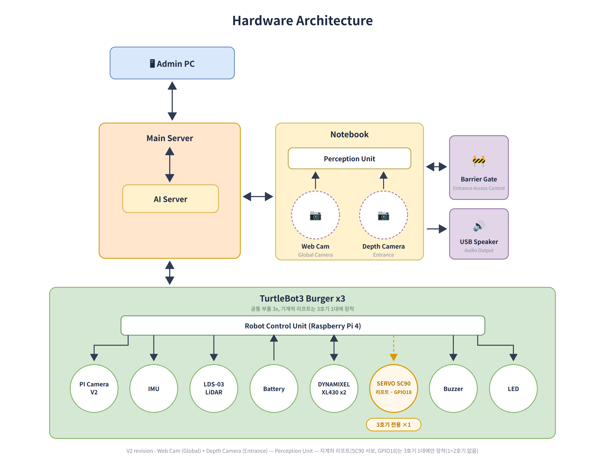
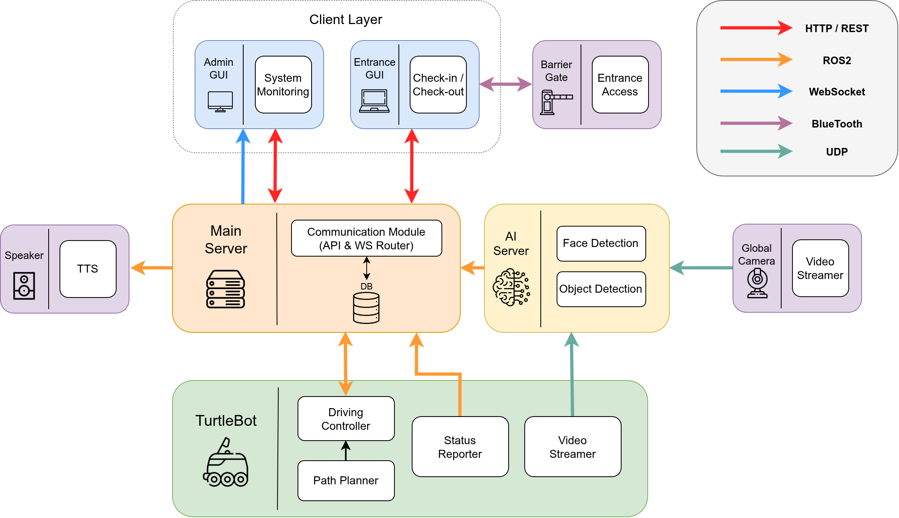
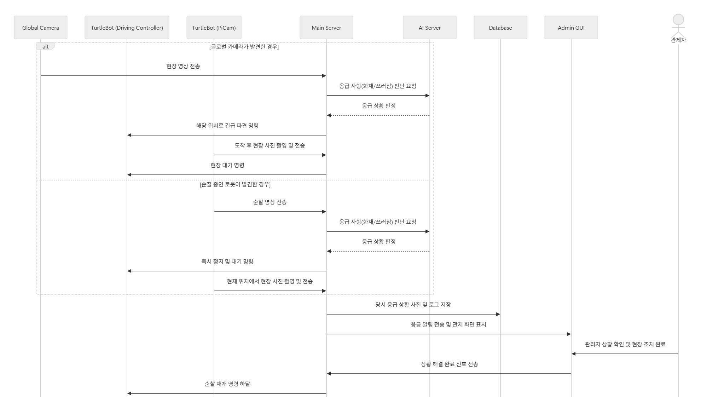
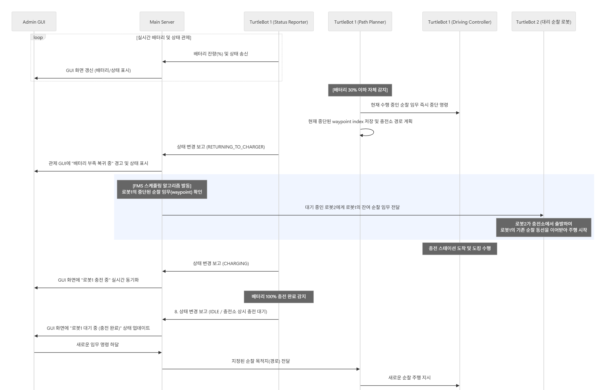
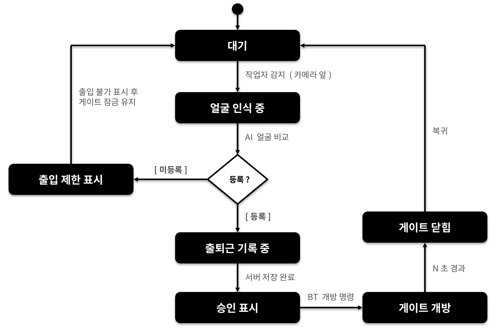
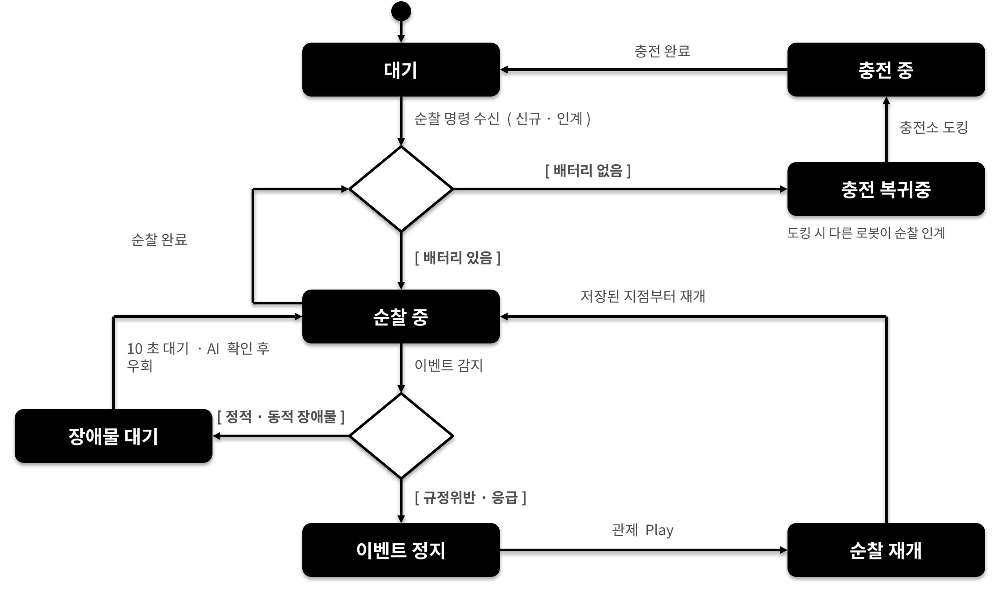
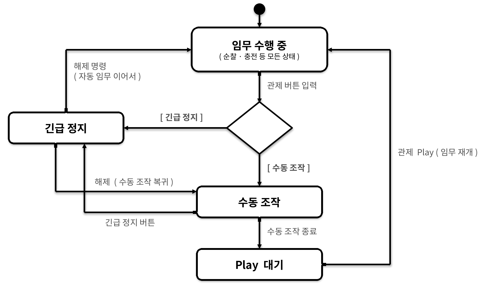
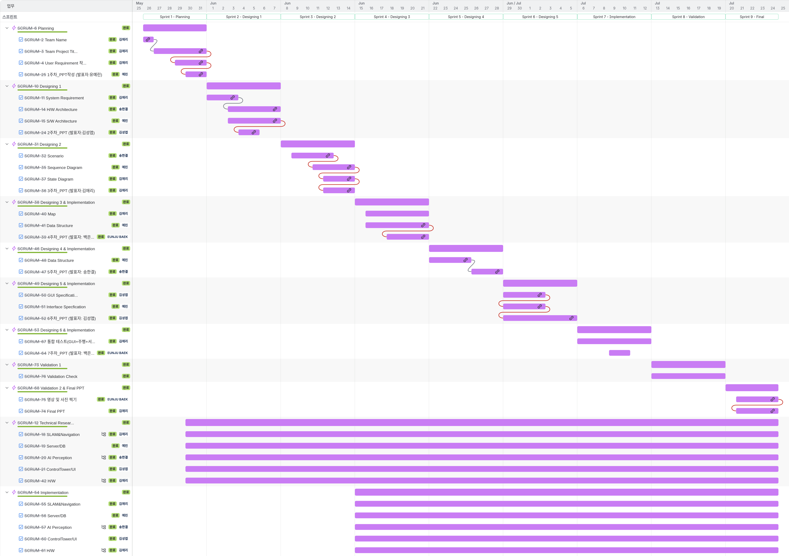

# AI 기반 물류센터 안전 · 인력관리 자율주행 로봇 시스템

### 4조 닌자거북이 · 조별 프로젝트

> **반복 순찰은 로봇이 맡고, 판단은 AI가 돕고, 모든 상태는 관제에서 추적합니다.**

TurtleBot3 기반 다중 로봇이 물류센터를 자율 순찰하고, 글로벌 캠 · 로봇 카메라 AI가 위험 상황을 감지하며, 통합 관제에서 현장 대응까지 수행하는 스마트 팩토리 프로젝트입니다.

| 항목 | 내용 |
| :--- | :--- |
| 팀 | **4조 닌자거북이** (5인) |
| 주제 | AI 기반 물류센터 안전 · 인력관리 자율주행 로봇 시스템 |
| 기간 | 2026년 5월 26일 ~ 7월 24일 (약 2개월) |
| 담당 파트 | 자율주행 · 하드웨어 / AI Perception / Server & DB / 관제 GUI Control Tower |
| 로봇 | TurtleBot3 Burger 기반 멀티 로봇 (순찰 교대 · 지게차 물품 운반) |
| 핵심 기능 | 자율 순찰 · 이벤트 자동 파견 · 자동 충전 · 얼굴인식 출입 · 통합 관제 |

▶ **[프로젝트 소개 영상 보기 (YouTube)](https://youtu.be/U24qxTHOJKM)**

## 1. 팀 구성 및 역할

| 담당자 | 담당 파트 | 주요 기여 |
| :---: | :---: | --- |
| 김⁠애⁠리<br>(팀장) | 자⁠율⁠주⁠행 ⁠· ⁠하⁠드⁠웨⁠어 | SLAM · Nav2 기반 순찰, 장애물 대응, 자동 충전 · 로봇 교대, 마그네틱 충전 구조, 지게차 포크 · 물품 운반 구현 |
| 김⁠성⁠엽 | 관⁠제⁠ ⁠G⁠U⁠I⁠ ⁠C⁠o⁠n⁠t⁠r⁠o⁠l⁠ ⁠T⁠o⁠w⁠e⁠r | Unity 기반 Dashboard · Factory · Robot · Map 관제 화면, 실시간 상태 · 영상 · 이벤트 표시, 수동 제어 UI 구현 |
| 백⁠은⁠주 | A⁠I⁠ ⁠P⁠e⁠r⁠c⁠e⁠p⁠t⁠i⁠o⁠n | 안전모 미착용 · 쓰러짐 · 화재 개별 객체인식 모델의 통합을 선행 시도 · 검증하고, 최종 통합 모델 방향을 마련 |
| 송⁠한⁠결 | A⁠I⁠ ⁠P⁠e⁠r⁠c⁠e⁠p⁠t⁠i⁠o⁠n⁠ · ⁠하⁠드⁠웨⁠어 | 최종 객체인식 통합 모델 채택 · 고도화, 객체인식 노드와 글로벌 캠 · 로봇 카메라 런처 구현, 안면인식 · 출입 연동, 출입문과 AI 스피커 연동 |
| 유⁠예⁠린 | S⁠e⁠r⁠v⁠e⁠r⁠ ⁠&⁠ ⁠D⁠B | FastAPI · PostgreSQL · ROS 2 연동, 이벤트 큐 · 자동 배차, WebSocket 관제 연동, 출입 · 사건 · 로봇 운용 이력 관리 |

## 2. 프로젝트 주제

**AI 기반 물류센터 안전 · 인력관리 자율주행 로봇 시스템**

자율주행 로봇이 물류센터를 순찰하고, AI가 안전모 미착용 · 화재 · 작업자 쓰러짐을 감지합니다. 감지 결과는 FMS 서버를 거쳐 관제 UI, DB, TTS와 연동되며, 필요할 때는 가용 로봇을 현장으로 자동 파견합니다. 직원은 얼굴인식, 방문자는 QR 기반으로 출입을 관리합니다.

## 3. 주제 선정 이유

스마트 물류센터에서는 반복 순찰과 안전 관리를 지속적으로 수행해야 합니다. 그러나 고정 CCTV와 사람 중심 감시는 사각지대와 관제 피로도 문제가 있습니다.

- **반복 업무 자동화**: 순찰 · 충전 · 상태 보고를 로봇이 수행합니다.
- **위험 상황 조기 감지**: 안전모 미착용, 화재, 작업자 쓰러짐을 AI로 감지합니다.
- **현장 대응 강화**: 글로벌 캠이 발견한 이벤트에 로봇을 파견해 근거리에서 재확인합니다.
- **통합 운영**: 로봇 · AI · 출입 · 사건 · 영상을 하나의 관제 화면과 DB에서 관리합니다.
- **인력 관리 확장**: 안면인식 출퇴근과 QR 방문자 출입을 자동문과 연결합니다.

## 4. 사용자 요구사항 (User Requirements)

| ID | 사용자 요구사항 |
| --- | --- |
| UR_01 | 로봇이 공장을 순찰할 수 있어야 한다. |
| UR_02 | 로봇이 직원을 구분할 수 있어야 한다. |
| UR_03 | 로봇이 규정위반을 알릴 수 있어야 한다. |
| UR_04 | 로봇이 응급 상황을 알릴 수 있어야 한다. |
| UR_05 | 로봇은 장애물을 인식할 수 있어야 한다. |
| UR_06 | 로봇은 긴급 정지를 할 수 있어야 한다. |
| UR_07 | 로봇은 자동충전 기능이 있어야 한다. |
| UR_08 | 관리자가 로봇의 상태를 모니터링할 수 있어야 한다. |
| UR_09 | 로봇은 물품을 운반할 수 있어야 한다. |

## 5. 시스템 요구사항 (System Requirements)

| ID | 기능 | 요구사항 |
| --- | --- | --- |
| SR_01 | 공장 순찰 | 지정된 순찰 구역을 반복 이동하고, 현재 위치를 전송하며, 장애물 회피 후 순찰을 계속한다. |
| SR_02 | 직원 출퇴근 구분 | 직원을 인식해 직원 · 외부인 및 출근 · 퇴근을 구분한다. |
| SR_03 | 규정 위반 감지 | 작업자의 안전모 미착용을 감지한다. |
| SR_04 | 응급 상황 감지 | 작업자 쓰러짐, 화재 경보, 정전 등의 응급 상황을 감지한다. |
| SR_05 | 장애물 인식 | 정적 장애물(적재물)과 동적 장애물(지게차 · 다른 로봇)을 감지 · 분류한다. |
| SR_06 | 장애물 회피 | 정적 장애물은 우회 경로를 생성하고, 동적 장애물은 정지 후 이동을 재개한다. |
| SR_07 | 긴급 정지 | 관리자 명령, 배터리 이상, 통신 이상에서 즉시 정지한다. |
| SR_08 | 관제 알림 | 규정 위반, 응급 상황, 장애물, 배터리 부족, 통신 상태를 관제에 알린다. |
| SR_09 | 상태 모니터링 | 배터리 · 주행 · 순찰 · 경고 · 통신 · 작업 상태를 실시간으로 확인한다. |
| SR_10 | 실시간 위치 표시 | 현재 위치, 이동 경로, 목표 위치, 순찰 구역, 응급 상황 위치를 맵에 표시한다. |
| SR_11 | 자동 충전 | 배터리를 확인해 충전소로 복귀하고, 충전 완료 후 이전 임무를 재개한다. |
| SR_12 | 데이터 저장 | 순찰 · 규정 위반 · 응급 상황 · 당시 카메라 캡처를 DB에 저장한다. |
| SR_13 | 데이터 조회 | 관제에서 날짜 · 시간 · 종류 기준으로 로그와 이벤트를 조회한다. |
| SR_14 | 멀티 로봇 협업 | 로봇이 이탈하면 다른 로봇이 순찰 임무를 이어받는다. |

## 6. 시스템 아키텍처

### 하드웨어 아키텍처



### 소프트웨어 아키텍처



## 7. 운영 시나리오

### Scenario 1. 작업자 출퇴근 얼굴인식

1. 작업자가 출입구 카메라 앞에 섭니다.
2. AI 안면인식 시스템이 등록된 직원 정보와 비교합니다.
3. 등록된 직원이면 출근 또는 퇴근을 기록하고, 서버에 출입 정보를 저장합니다.
4. 노트북이 Bluetooth로 배리어게이트에 개방 명령을 전송하고, 일정 시간 후 자동으로 닫힙니다.
5. 미등록 인물은 출입 불가 메시지를 표시하고 게이트 잠금 상태를 유지합니다.
6. 관제 웹은 출입 기록을 실시간으로 표시합니다.

### Scenario 2. 물류센터 순찰

1. 관제에서 순찰 명령이 내려오면 로봇은 지정된 경로를 따라 이동합니다.
2. 정적 장애물은 응급 상황 여부를 판별한 뒤 새 경로를 생성해 우회합니다.
3. 동적 장애물은 즉시 정지한 뒤 5초간 대기하고, 사라지면 순찰을 재개합니다.
4. 순찰 중 작업장 환경을 모니터링하며, 완료 후 충전 장소에서 다음 임무를 대기합니다.

### Scenario 3. 안전모 미착용 감지 (위반사항)

1. 글로벌 관제 카메라 또는 순찰 로봇이 작업자를 촬영합니다.
2. AI가 안전모 미착용을 규정 위반으로 판단합니다.
3. 글로벌 캠 감지 시 로봇을 해당 위치로 파견해 증거 사진을 촬영하고, 로봇 카메라 감지 시에는 즉시 정지해 현재 위치에서 촬영합니다.
4. 발생 시간 · 위치 · 증거를 서버에 저장하고 관제에 경고를 전송합니다.
5. TTS로 안전모 착용을 안내하고, 관제자가 확인 후 재개 명령을 내리면 순찰을 재개합니다.

### Scenario 4. 응급 사항 감지 (화재, 작업자 쓰러짐)

1. 글로벌 관제 카메라 또는 순찰 로봇이 현장을 촬영합니다.
2. AI가 쓰러짐 또는 화재를 감지하면 응급 상황으로 판단합니다.
3. 글로벌 캠 감지 시 로봇을 긴급 파견하고, 로봇 카메라 감지 시에는 즉시 정지합니다.
4. 현장 사진을 저장하고 관제에 응급 알림과 TTS 방송을 전송합니다.
5. 로봇은 현장에서 대기하며, 관리자가 해결 후 재개를 명령하면 순찰을 이어갑니다.

### Scenario 5. 자동 충전과 순찰 교대

1. 로봇은 배터리 상태를 지속적으로 확인합니다.
2. 배터리 잔량이 기준 이하인 33%가 되면 충전 모드로 전환합니다.
3. 작업 중이면 충전 스테이션으로 이동하고, 다른 로봇이 남은 순찰 웨이포인트를 이어서 수행합니다.
4. 충전 완료 후 대기 상태로 전환하며, 새 작업 요청이 들어오면 임무를 수행합니다.

### Scenario 6. 관제 서버 수동 조작 및 긴급 정지

1. 관제자는 로봇 상태를 실시간으로 모니터링합니다.
2. 이상 상황 시 GUI로 수동 제어 모드에 진입해 전진 · 후진 · 좌회전 · 우회전 · 정지를 수행합니다.
3. 긴급 정지 버튼을 누르면 로봇은 즉시 정지하고 현재 임무를 중단합니다.
4. 관제에서 재개 명령을 내리면 로봇은 중단된 임무를 이어서 수행합니다.

## 8. 시퀀스 다이어그램

프로젝트의 주요 기능은 사전에 시퀀스 다이어그램으로 역할과 데이터 흐름을 합의한 뒤 구현했습니다.

### Scenario 1. 작업자 출퇴근 얼굴인식


### Scenario 2. 물류센터 순찰


### Scenario 3. 안전모 미착용 감지 (위반사항)


### Scenario 4. 응급 사항 감지 (화재, 작업자 쓰러짐)



### Scenario 5. 자동 충전과 순찰 교대



### Scenario 6. 관제 서버 수동 조작 및 긴급 정지


## 9. 상태 다이어그램

로봇 · 관제의 상태 전환과 예외 처리를 구현 전에 정의해, 통합 과정의 상태 충돌을 줄였습니다.

### Scenario 1. 작업자 출퇴근 얼굴인식



### Scenario 2~5. 순찰 및 이벤트 사항 대응



### Scenario 6. 관제 서버 수동 조작 및 긴급 정지



## 10. 물류센터 맵과 순찰 경로


- Cartographer SLAM으로 생성한 약 **1.8 × 1.8m** 크기의 창고형 단일 폴리곤 맵입니다.
- 복도 폭은 약 **40cm**이며, 총 **14개 Waypoint**를 등록했습니다.
- **충전 구역**은 로봇의 시작 · 복귀 지점, **컨베이어 구역**은 물품 이동 · 이벤트 감지 구역입니다.
- **팔레트 구역**은 정적 장애물 회피를 검증하고, **출입구 구역**은 얼굴인식 출입 관리를 검증합니다.
- 로봇은 충전 구역에서 출발해 웨이포인트를 순찰하며, 장애물 회피 · 이벤트 대응 · 충전 복귀 후 임무 재개를 수행합니다.

## 11. 소스 구성

```text
.
├── ai_perception/                       # 안면·객체인식, 글로벌 캠 · 로봇 카메라 처리
├── controltower_ui/                     # Unity 기반 통합 관제 UI
├── hardware/                            # 마그네틱 충전 · 지게차 리프트 하드웨어
├── server_db/                           # FastAPI, PostgreSQL, FMS, Domain Bridge
├── slam_navigation/                     # SLAM, Nav2, 도킹, 로봇 런처
└── assets/                              # README용 아키텍처 · 다이어그램 · 맵 · 타임라인 이미지
```

각 구현 파트의 상세 내용은 해당 폴더의 README를 참고하세요.

## 12. 프로젝트 타임라인



**프로젝트 기간: 2026년 5월 26일 ~ 2026년 7월 24일**

프로젝트 일정과 작업 단위는 Jira로 관리했습니다. 요구사항 · 시나리오 · 인터페이스를 먼저 합의하고, 파트별 구현과 통합 · 검증을 반복하는 방식으로 진행했습니다.

## 13. 프로젝트 기술 스택

### 로봇·자율주행


### 하드웨어


### 3D 모델링·설계


### 사용 언어·웹 기술


### AI·컴퓨터 비전


### 서버·데이터·통신


### 관제 UI


### 협업·프로젝트 관리


- **Jira**로 스프린트, 작업 단위, 일정과 진행 상태를 관리했습니다.
- **Confluence**로 요구사항, 시나리오, 회의 내용, 인터페이스를 문서화했습니다.
- **Git·GitHub**으로 소스 코드 버전 관리, 브랜치 기반 작업, Pull Request 검토 · 병합을 수행했습니다.
- **Slack**으로 실시간 소통, 작업 공유, 통합 테스트 일정을 조율했습니다.

## 14. 보안 및 제외 항목

다음 실행 자산과 민감 정보는 저장소에 포함하지 않습니다.

- `.env`, DB 비밀번호와 DB 덤프
- 직원 얼굴 이미지·얼굴 임베딩
- AI 모델 가중치
- 런타임 로그, 영상, 사건 캡처 이미지
- ROS2 빌드·설치 산출물

---

**4조 닌자거북이**
