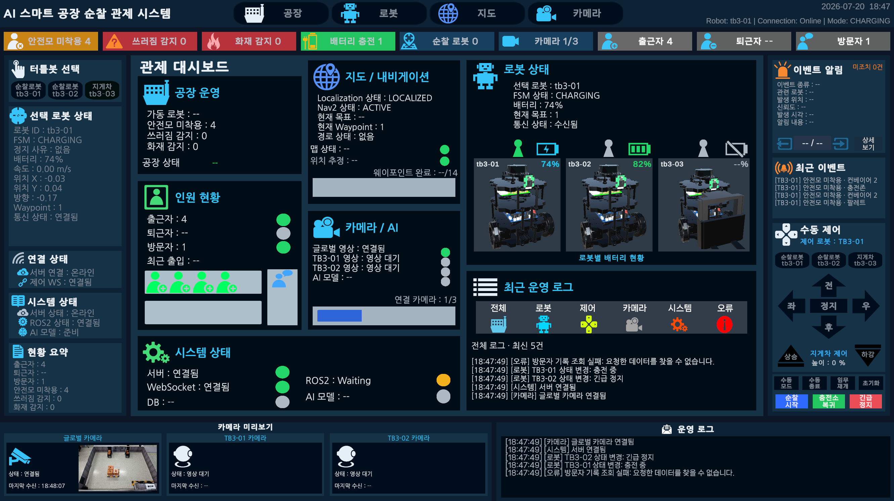
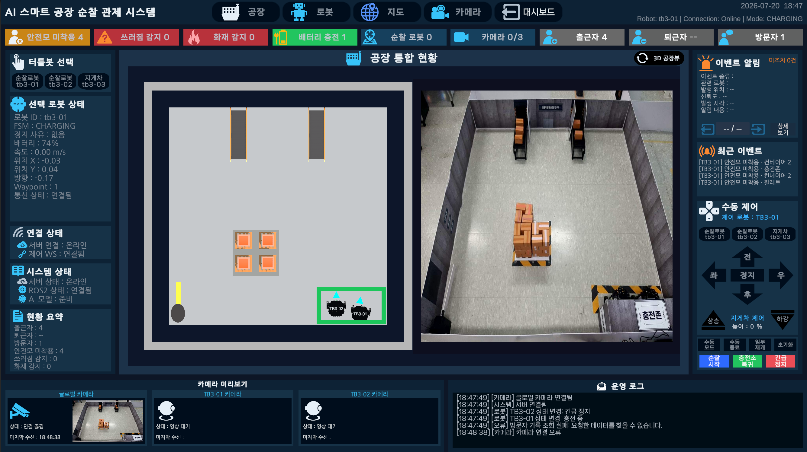
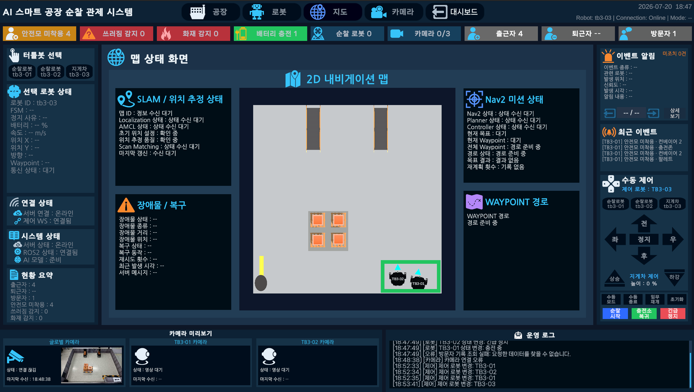

# TB3 Control Tower UI

Unity 기반 스마트 공장 순찰 로봇 통합 관제 UI입니다.

## 대표 전체 화면



## 프로젝트 개요

실제 TurtleBot3의 상태, 위치, 순찰 경로, 카메라 영상과 AI 안전 이벤트를
Unity 2D·3D 공장 화면에 표시합니다. Unity 관제 화면에서 실행한 제어 명령은
서버와 ROS2를 통해 실제 로봇에 적용했습니다.

이 폴더는 팀 통합 프로젝트 중 김성엽이 담당한 Unity Control Tower UI의
구현 범위와 최종 결과를 소개합니다. 전체 Unity 실행 프로젝트와 원본 소스는
포함하지 않으며, 최종 화면과 기술 문서를 중심으로 유지합니다.

## 담당자 및 담당 범위

담당자: 김성엽

- Unity 관제 UI 구조와 공통 화면을 구현했습니다.
- Dashboard / Factory / Robot / Map / Camera View를 구현했습니다.
- REST API / WebSocket / Camera Stream 연동을 적용했습니다.
- 로봇 상태, 위치, Waypoint와 순찰 경로를 표시합니다.
- AI 이벤트 Popup / Snapshot / 운영 로그 연동을 적용했습니다.
- 수동 주행, 긴급정지와 충전소 복귀 제어를 구현했습니다.
- TB3-03 지게차 리프트와 팔레트 운반 동작을 표시합니다.
- 화면 전환, 경로와 카메라 상태를 안정적으로 유지합니다.

## 주요 기능

- 실제 로봇의 위치, 방향, 배터리와 주행 상태를 2D·3D 화면에 표시합니다.
- 서버가 전달한 Waypoint, Route와 Nav2 임무 상태를 표시합니다.
- Global CCTV와 TB3 카메라의 실제 프레임 수신 상태를 표시합니다.
- 화재, 쓰러짐과 안전모 미착용 이벤트를 관제 화면에 표시합니다.
- 선택 로봇의 수동 주행, 긴급정지와 복귀 명령을 적용했습니다.
- 출퇴근·방문자 현황과 최근 운영 로그를 Dashboard에 표시합니다.

## 주요 화면

### Dashboard View


공장 운영, 로봇, 출입 현황, 카메라·AI와 시스템 상태를 한 화면에 표시합니다.
최근 운영 로그와 선택 로봇의 핵심 상태를 함께 표시합니다.

### Factory View



실제 로봇 위치와 공장 설비를 Unity 2D·3D 가상 공장에 표시합니다.
미니맵과 Global CCTV를 함께 표시해 위치와 현장 상황을 비교합니다.

### Robot View


선택 로봇의 상태, 배터리, 속도와 명령 응답을 표시합니다.
수동 주행, 긴급정지, 충전소 복귀와 지게차 제어를 적용했습니다.

### Map Status View



서버에서 받은 로봇 위치, Waypoint와 Route 진행 상태를 표시합니다.
Nav2 임무, 장애물과 복구 상태를 함께 표시합니다.

Camera·AI 및 안전 이벤트 화면은 개인정보를 제거한 공개용 캡처 준비 후
추가할 예정입니다.

## 시스템 연동 구조

```text
TurtleBot3 / Camera / AI
        ↓
ROS2 / FastAPI Server
        ↓
REST API / WebSocket / Camera Stream
        ↓
Unity Control Tower UI
        ↓
Dashboard / Factory / Robot / Map / Camera / Event
```

Unity 제어 명령은 FastAPI 서버와 ROS2를 거쳐 TurtleBot3에 적용했습니다.
로봇 상태, 명령 결과와 이벤트는 실시간 메시지로 다시 관제 화면에 표시합니다.

## 디지털 트윈 구현 범위

- 실제 로봇의 위치와 방향을 Unity 2D·3D 공장에 표시합니다.
- 실제 로봇의 상태, 배터리와 속도를 표시합니다.
- 서버 순찰 경로, Waypoint와 AI 안전 이벤트를 표시합니다.
- Global CCTV와 TB3 카메라 영상을 표시합니다.
- Unity 관제 명령을 서버와 ROS2를 통해 실제 로봇에 적용했습니다.
- TB3-03 리프트는 실제 높이 센서값이 아니라 서버가 승인한 명령을 기준으로 표시합니다.

## 기술 문서

- [문서 목차](docs/README.md)
- [시스템 구조](docs/01-architecture.md)
- [화면 구성](docs/02-ui-views.md)
- [실시간 통신 연동](docs/03-integration.md)
- [문제 해결 과정](docs/04-troubleshooting.md)
- [공개 및 보안 기준](docs/05-security.md)
- [문서 및 이미지 구조](docs/06-project-structure.md)

## 팀 프로젝트 안내

이 문서는 팀 통합 프로젝트 중 Unity Control Tower UI 담당 범위를 정리한 문서입니다.
AI 인식, 서버·데이터베이스, 하드웨어와 SLAM·내비게이션 구현은 저장소의
`ai_perception`, `server_db`, `hardware`, `slam_navigation` 폴더에서 유지합니다.
