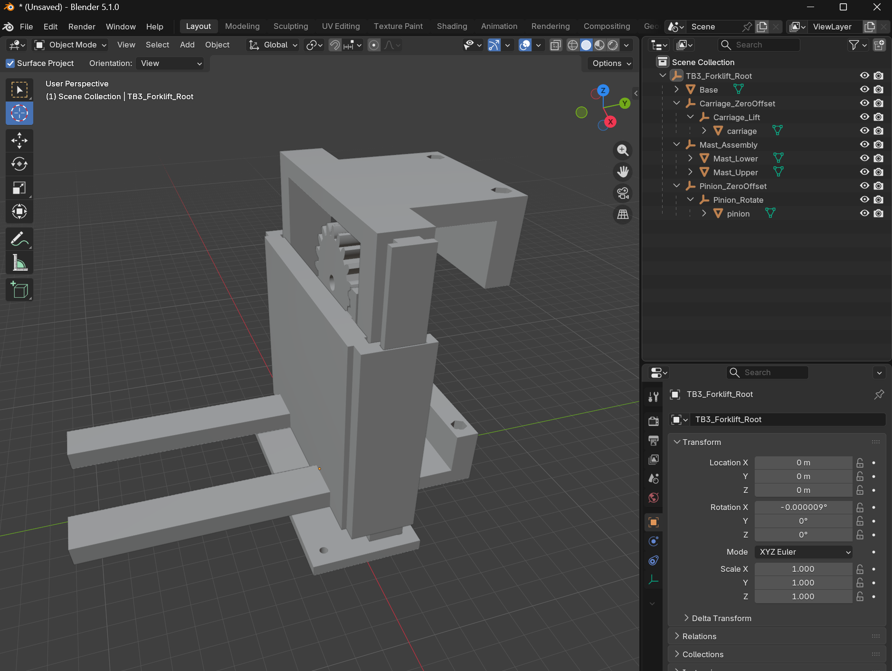
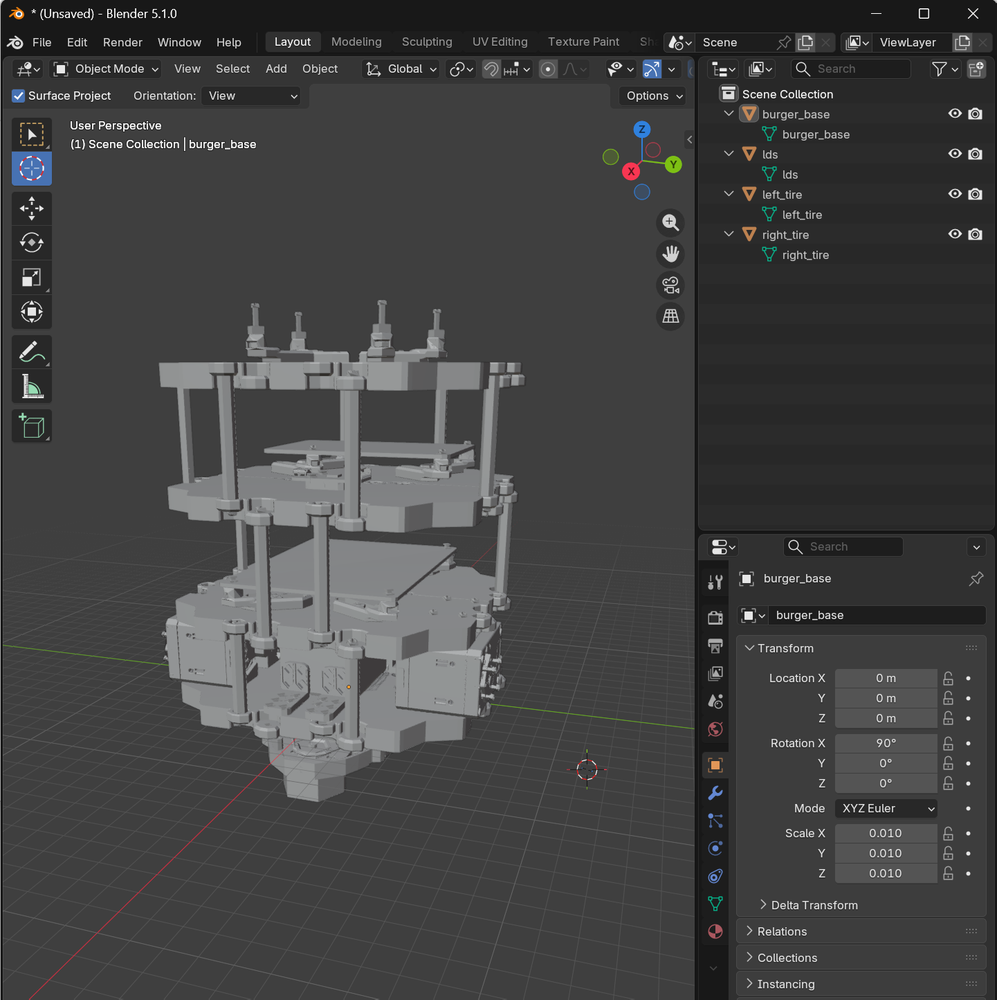
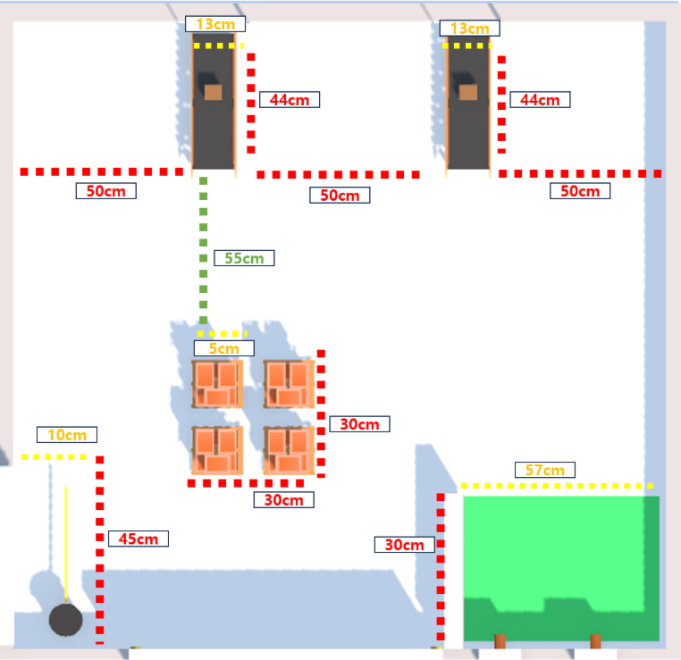
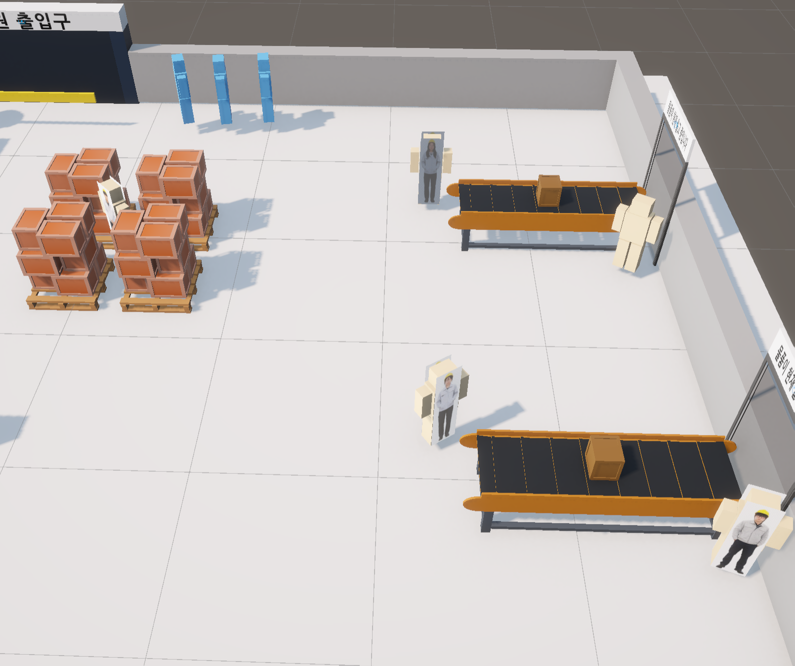
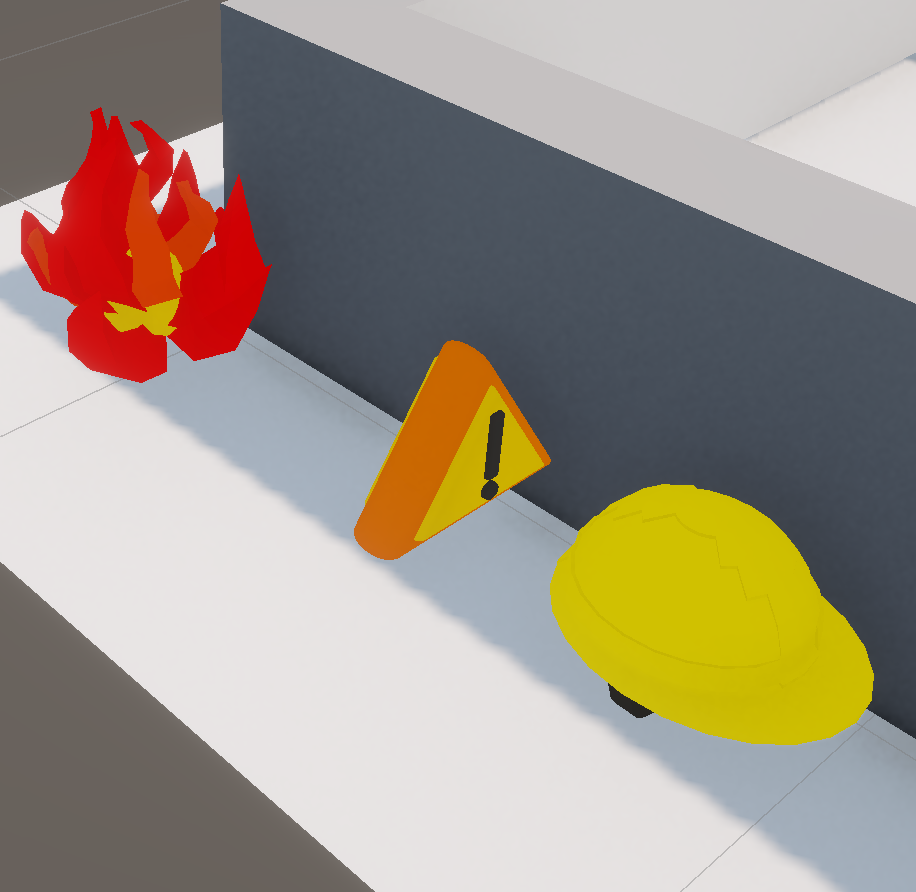
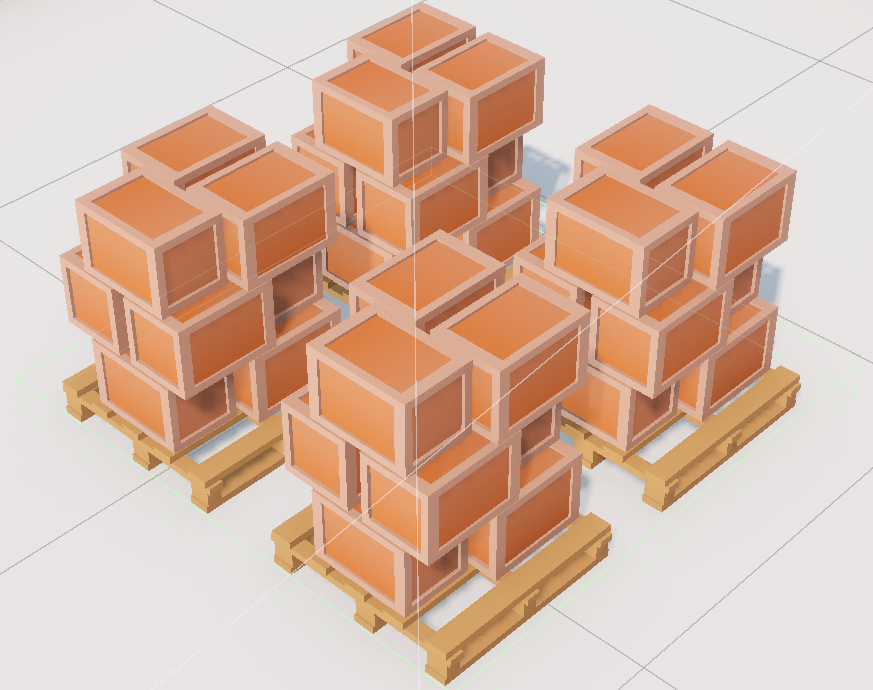
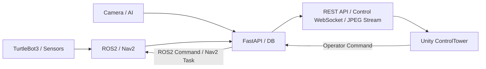

# TB3 Smart Factory Control Tower

> Unity·ROS2·AI 기반 스마트 물류센터 통합 관제 시스템

  

## 프로젝트 정보

| 항목 | 내용 |
|:---|:---|
| 개발 형태 | 5인 팀 프로젝트 |
| 개발 기간 | 2026.05.25 ~ 2026.07.24 |
| 개인 담당 | Unity ControlTower UI 설계·구현, 서버·카메라 연동, 상태·경로·이벤트·제어 시각화 |
| 개발 환경 | Unity 6000.3.10f, C#, Unity uGUI, TextMesh Pro, Blender |
| 연동 기술 | REST API, WebSocket, JPEG Camera Stream |
| 팀 기술 | ROS2, Nav2, FastAPI, PostgreSQL, TurtleBot3 |
| 프로젝트 상태 | 팀 통합 시연 및 포트폴리오 문서 정리 완료 |

## 핵심 결과

| 항목 | 구현 결과 |
|:---|:---|
| 관제 화면 | Dashboard·Factory·Robot·Map Status·Camera 5개 View |
| 실시간 연동 | REST API·Control WebSocket·JPEG Camera WebSocket |
| 카메라 구성 | Global·TB3-01·TB3-02 총 3개 스트림 |
| 운영자 제어 | 순찰 시작·재개·복귀·긴급정지·초기화·수동 주행·STOP |
| 상태 반영 | 로봇 Pose·배터리·속도·Route·Waypoint·AI 이벤트·출입 현황 |
| Unity C# 구조 | Bridge·Core·UI, C# 19개 |
| 포트폴리오 자료 | 이미지 17개·시연 영상 14개 |

## 프로젝트 개요

TurtleBot3, ROS2·Nav2, AI 인식, FastAPI·DB와 Unity 2D·3D 공장을 연결해 로봇 상태, 순찰 경로, 카메라 영상, 안전 이벤트와 운영자 제어를 한 화면에서 관리하는 통합 관제 시스템입니다.

저는 팀 시스템의 운영 접점인 Unity ControlTower를 담당했습니다. Dashboard, Factory, Robot, Map Status, Camera View를 구성하고 REST API, 관제 WebSocket과 JPEG Camera Stream을 연동해 로봇 위치·상태·배터리·경로, 출입 현황과 안전 이벤트를 표시했습니다.

AI, ROS2·Nav2, Server·DB와 Hardware 파트의 데이터를 Unity ControlTower에서 연결해 상태와 이벤트를 통합했습니다. 이 저장소는 관제 화면 설계, 데이터 연동, 상태 시각화와 운영자 제어 흐름을 중심으로 정리합니다.

## 개인 담당

- Top·Left·Right·Bottom 공통 관제 영역과 중앙 View 구조 설계
- Dashboard / Factory / Robot / Map Status / Camera View 구현
- REST API 조회·명령 요청과 `/ws/control-tower` 이벤트 분기
- Global CCTV·TB3-01·TB3-02 JPEG Camera Stream 수신과 상태 표시
- `ROBOT_STATUS` 기반 Pose·방향·배터리·속도·Nav2 상태 표시
- Route·Waypoint 진행 상태와 장애물·복구 상태 시각화
- AI 안전 이벤트 Popup·Snapshot·최근 이벤트·운영 로그 연결
- 순찰 시작·임무 재개·충전소 복귀·긴급정지·초기화 요청 UI
- 수동 모드 진입·종료와 전진·후진·좌·우·정지 요청 UI
- TB3-03 리프트와 팔레트 운반 상태 시각화
- 화면 재진입 Pose 복원, 부분 Route 패킷 보호와 실제 프레임 기준 카메라 상태 처리
- UI 한글화, 통합 시연 화면과 포트폴리오 문서 정리

## 설계 원칙

| 원칙 | 적용 내용 |
|:---|:---|
| 실제 데이터 우선 | 최종 Runtime 화면은 REST·WebSocket·JPEG Stream의 실제 수신값만 표시 |
| 미수신 명시 | 서버가 제공하지 않은 값은 임의 생성하지 않고 `--` 또는 미수신 상태로 표시 |
| Optimistic Update 제거 | HTTP 요청 성공만으로 장치 상태를 확정하지 않고 ACK 또는 후속 `ROBOT_STATUS` 사용 |
| 부분 메시지 보호 | 필드가 누락된 상태 메시지가 기존 정상 Pose·Route·Waypoint를 지우지 않도록 분리 갱신 |
| 영상 상태 분리 | WebSocket 연결과 마지막 실제 JPEG 프레임 적용 상태를 별도로 관리 |
| 협업 데이터 통합 | AI·서버·자율주행·하드웨어 상태와 명령 결과를 공통 화면과 운영 로그로 연결 |

## 핵심 시연

### 통합 관제 및 제어

선택 로봇 상태, 공통 관제 영역과 운영자 명령 UI의 동작을 확인할 수 있습니다.

https://github.com/user-attachments/assets/52d3d2e0-575b-4442-bbe4-073944d63f12

### 안전모 미착용 이벤트

AI 파트가 전달한 안전 이벤트를 Unity Popup과 관제 상태로 연결한 흐름입니다.

https://github.com/user-attachments/assets/bf70abcc-fff6-46d1-b8c6-f47bd1e08406

### 지도·경로 상태

로봇 Pose, Route·Waypoint와 진행 상태를 Map Status View에서 확인할 수 있습니다.

https://github.com/user-attachments/assets/e13f0af1-54d8-4f9a-936a-4cf1701c2a06

### 로봇 교대 및 카메라 이벤트

순찰 로봇 교대와 TB3 카메라 이벤트가 관제 화면에 반영되는 흐름입니다.

https://github.com/user-attachments/assets/653295ed-d66b-4cff-8cdb-618c86af6dfb

전체 편집 영상과 짧은 반복 영상 14개는 [시연 영상](docs/demo/README.md)에 정리했습니다.

## 주요 화면

### Dashboard View

로봇, 출입, 카메라, 서버와 최근 이벤트를 한 화면에서 요약합니다.

  

### Factory View

2D 지도와 Global CCTV를 비교하고, 3D 공장에서 로봇·설비·팔레트와 이벤트 위치를 확인합니다.

<table>
  <tr>
    <td width="50%" align="center"> <strong>Factory 2D</strong></td>
    <td width="50%" align="center"> <strong>Factory 3D</strong></td>
  </tr>
</table>

### Robot View

선택 로봇의 상태, Pose, 배터리, 속도와 명령 결과를 표시하고 수동 주행, 긴급정지, 복귀와 지게차 제어를 제공합니다.

  

### Map Status View

현재·다음·완료 Waypoint와 Route 진행 상태, Nav2 임무와 장애물 복구 상태를 표시합니다.

  

### Camera View

Global CCTV와 TB3-01·TB3-02 카메라를 분리하고 실제 JPEG 프레임 기준으로 영상 상태를 판정합니다.

  

## 3D 모델링 및 Unity 통합

관제 화면에 필요한 TB3, 지게차, 탑재 부품, 공장 설비와 팔레트 모델을 Blender와 Unity에서 제작하거나 수정·통합했습니다. FBX·STL 모델의 Scale, Axis, Pivot, Material과 Hierarchy를 정리하고 Factory 3D View, Robot View와 안전 이벤트 시각화에 적용했습니다.

<table>
  <tr>
    <td width="50%" align="center"> <strong>TB3 지게차 전체 모델링</strong></td>
    <td width="50%" align="center"> <strong>TB3 본체 모델링</strong></td>
  </tr>
  <tr>
    <td width="50%" align="center"> <strong>공장 3D 맵 설계</strong></td>
    <td width="50%" align="center"> <strong>Unity 에셋 구성</strong></td>
  </tr>
  <tr>
    <td width="50%" align="center"> <strong>안전 이벤트 Marker</strong></td>
    <td width="50%" align="center"> <strong>팔레트 모델링</strong></td>
  </tr>
</table>

세부 부품 모델링과 Unity 적용 자료는 [Features 문서](docs/03_features.md#3d-모델링과-unity-적용)에서 확인할 수 있습니다.

## 시스템 구성

- **AI Perception:** 안면·객체 인식과 안전 이벤트 생성
- **SLAM / Navigation:** Pose·Route·Waypoint·순찰·도킹과 명령 실행
- **Server / DB:** 상태 통합, 기록 저장, REST·WebSocket 제공과 명령 중계
- **Hardware:** TurtleBot3, 충전 장치와 TB3-03 지게차 리프트
- **Unity ControlTower:** 상태·경로·영상·이벤트 표시와 운영자 제어 요청

## 데이터 연동

| 방식 | 주요 경로·이벤트 | Unity 적용 |
|:---|:---|:---|
| REST API | `/api/v1/robots/{robotId}/commands`, `/teleop` | 자동 명령·수동 주행·리프트 요청 |
| REST API | `/dashboard/today-summary`, 출입·방문·사건 조회 | Dashboard 집계와 이력 표시 |
| Control WebSocket | `/ws/control-tower` | 로봇 상태, 경로, AI 이벤트, 출입과 명령 결과 수신 |
| Camera WebSocket | `/ws/video/global`, `/ws/video/1`, `/ws/video/2` | Global·TB3-01·TB3-02 JPEG 영상 수신 |
| 주요 이벤트 | `ROBOT_STATUS`, `CAMERA_AI_STATUS`, `NEW_ALERT` | 상태·카메라·AI 이벤트 반영 |
| 운영 이벤트 | `patrol_timeline_event`, `patrol_log_update`, `command_ack` | Timeline·임무 이력·명령 결과 반영 |

TB3-03은 지게차 로봇으로 Camera View의 영상 집계에서 제외합니다.

## 문제 해결

| 문제 | 처리 | 결과 |
|:---|:---|:---|
| View 재진입 시 로봇 위치 초기화 | 로봇별 마지막 유효 Pose 보관과 활성화 즉시 복원 | 첫 프레임부터 최근 실제 위치 표시 |
| 부분 메시지로 Route 소실 | 일반 상태와 Route·Waypoint 갱신 경로 분리 | 기존 정상 경로 유지 |
| WebSocket 연결과 실제 영상 불일치 | 마지막 실제 JPEG 프레임 적용 시각 추적 | 사용자가 보는 영상 기준 상태 표시 |
| ROS 좌표와 Unity 위치 해석 차이 | 공통 좌표 변환과 공장 구역 경계 적용 | 2D·3D Marker와 구역명 일치 |
| 팔레트 부착·해제 자세 불안정 | 운반 상태별 부모 변경, Rigidbody 전환과 위치·회전 보간 | 픽업부터 Drop Slot 배치까지 자세 안정화 |
| HTTP 성공과 장치 실행 혼동 | 요청 응답과 `command_ack`·후속 상태를 분리 | Accepted·Rejected·실행 상태 구분 |

## 검증 범위

- Dashboard, Factory, Robot, Map Status, Camera View 표시
- 로봇별 Pose·방향·배터리·속도와 화면 재진입 상태 유지
- Route·Waypoint 부분 패킷과 로봇별 캐시
- Global·TB3-01·TB3-02 카메라와 실제 프레임 상태
- AI 안전 이벤트 Popup·Snapshot·최근 이벤트·운영 로그
- 순찰·재개·복귀·긴급정지·초기화와 수동 제어 요청
- TB3-03 리프트와 팔레트 운반 시각화

세부 검증 기준은 [Validation 문서](docs/05_validation.md)에서 확인할 수 있습니다.

## 기술 스택

| 구분 | 기술 |
|:---|:---|
| Engine | Unity 6000.3.10f |
| Language | C# |
| UI | Unity uGUI, TextMesh Pro |
| 3D | Blender, FBX, STL, Unity 3D |
| Data | REST API, WebSocket, JSON |
| Video | JPEG Camera Stream, `Texture2D.LoadImage` |
| Robot Integration | ROS2, Nav2, FastAPI |
| Collaboration | GitHub, Jira, Confluence, Slack |

## 상세 문서

| 문서 | 내용 |
|:---|:---|
| [문서 목차](docs/README.md) | 상세 문서 전체 목차 |
| [01. Overview](docs/01_overview.md) | 개발 배경, 운영 시나리오와 담당 범위 |
| [02. Architecture](docs/02_architecture.md) | 전체 연결 구조, 내부 계층과 책임 경계 |
| [03. Features](docs/03_features.md) | View별 기능, 시연과 3D 모델링 |
| [04. Data Flow](docs/04_data_flow.md) | REST·WebSocket·Camera Stream과 상태 처리 |
| [05. Validation](docs/05_validation.md) | 검증 원칙, 기능별 확인과 공개 자료 |
| [06. Project Scope](docs/06_project_scope.md) | 문제 해결, 구현 범위와 제한 |
| [07. Project Structure](docs/07_project_structure.md) | 개인·팀 저장소와 공개 파일 구조 |
| [Demo](docs/demo/README.md) | 공개 시연 영상 14개 |
