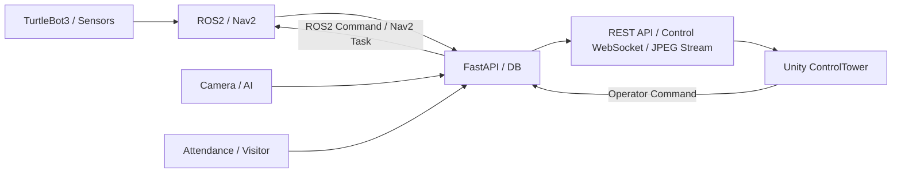
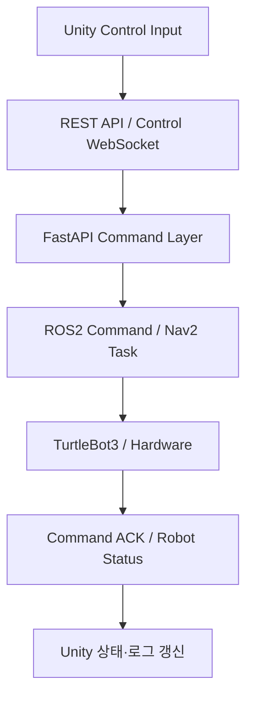

# 02. Architecture

## 전체 연결 구조



1. ROS2와 Nav2가 로봇 위치·상태·임무 정보를 서버에 전달합니다.
2. AI와 카메라가 감지 결과·Snapshot·영상 프레임을 전달합니다.
3. 서버는 조회 데이터와 명령 API를 REST로, 실시간 상태와 이벤트를 WebSocket으로 제공합니다.
4. Unity는 로봇별 최신 유효 상태를 보관하고 현재 View에 표시합니다.
5. 운영자 명령은 Unity에서 FastAPI·ROS2 명령 계층으로 전달됩니다.

## Unity 내부 계층

```text
Data Source
  REST API / Control WebSocket / JPEG Camera Stream
        ↓
Runtime State
  Robot Cache / Route Cache / Event Cache / Camera State
        ↓
Presentation
  Dashboard / Factory / Robot / Map Status / Camera / Popup
        ↓
Control Request
  Patrol / Resume / Return / E-STOP / Reset / Manual / Lift
```

| 계층 | 책임 |
|:---|:---|
| Data Source | 팀 서버의 조회·실시간·영상 데이터 수신 |
| Runtime State | 로봇별 최신 유효 상태, 경로, 이벤트와 카메라 상태 유지 |
| Presentation | 공통 관제 영역과 View별 화면 표시 |
| Control Request | 운영자 입력을 REST 또는 Control WebSocket 명령으로 전달 |

## 제어 명령 흐름



Unity는 HTTP 요청 성공만으로 실제 장치 상태를 확정하지 않습니다. REST 응답의 Accepted·Rejected 결과, `command_ack` 또는 후속 `ROBOT_STATUS`를 구분해 화면과 운영 로그에 반영합니다.

## 좌표 변환

```text
ROS Pose
  → 필드 존재·범위 유효성 검사
  → 원점·축·스케일 변환
  → Unity 2D / 3D 위치·회전
  → 공장 구역 경계 판정
```

같은 변환 기준을 로봇 Pose, 이벤트 Marker와 구역명에 적용해 화면마다 위치 해석이 달라지지 않도록 했습니다.

## 카메라 구조

```text
Global CCTV  → /ws/video/global
TB3-01       → /ws/video/1
TB3-02       → /ws/video/2
TB3-03       → No Stream
```

Global, TB3-01과 TB3-02는 독립된 WebSocket Client와 Texture를 사용합니다. Camera View의 선택 Main Feed와 하단 고정 Preview가 다른 스트림을 덮어쓰지 않도록 소스별 상태와 Texture를 분리했습니다.

---

[문서 목차](README.md) · [프로젝트 README](../README.md)
