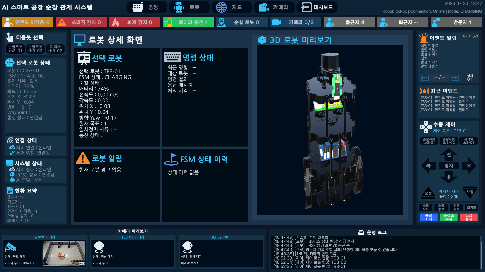
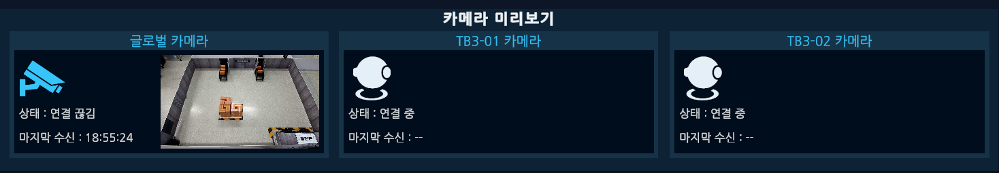
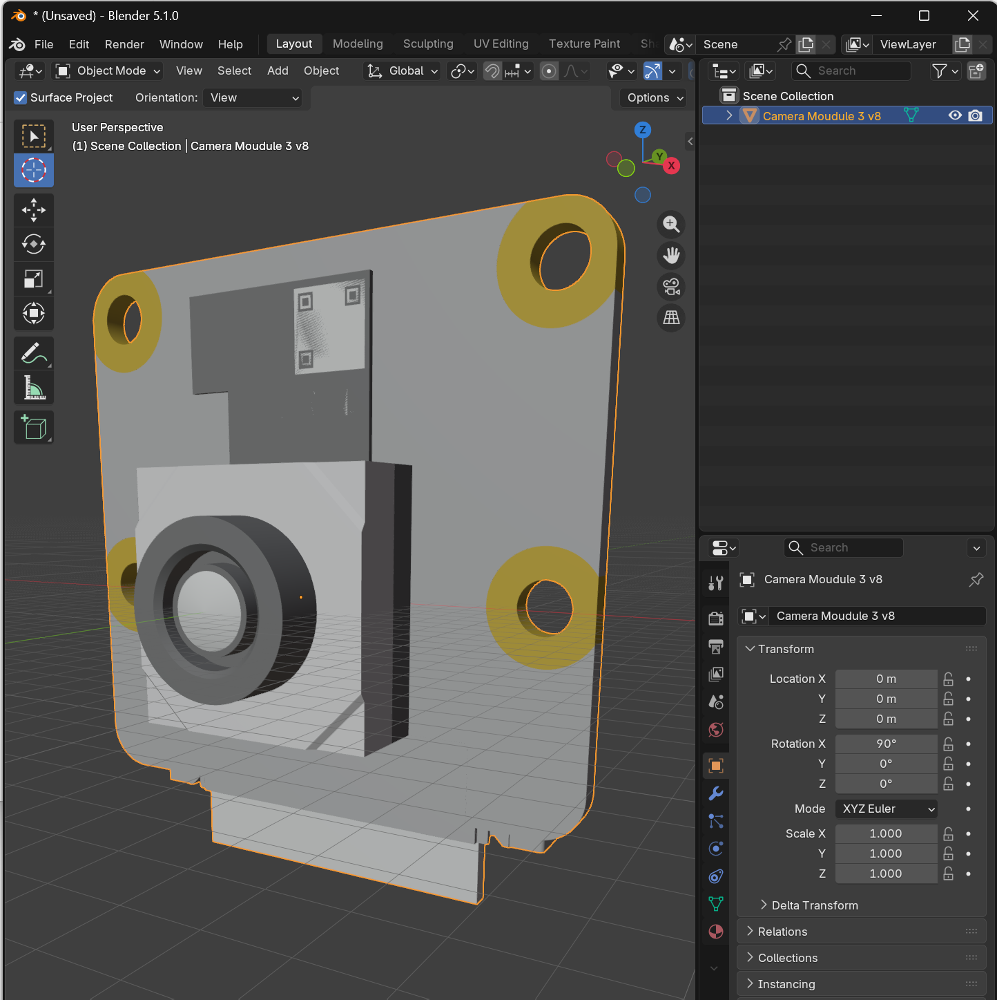
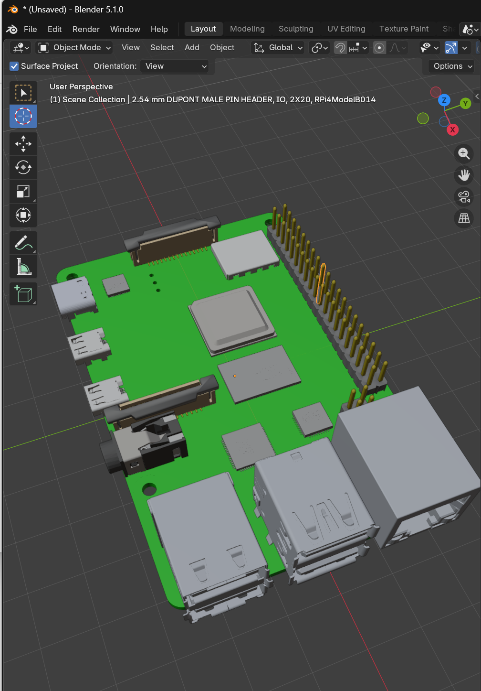
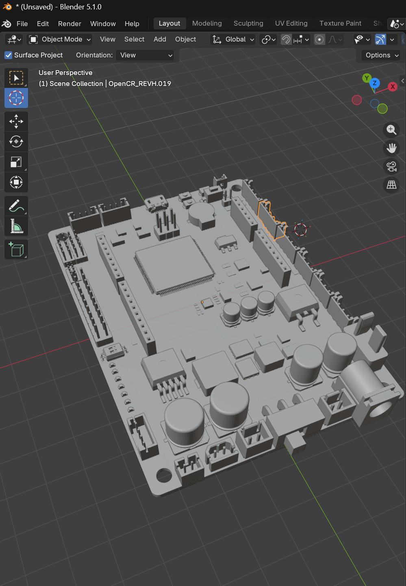
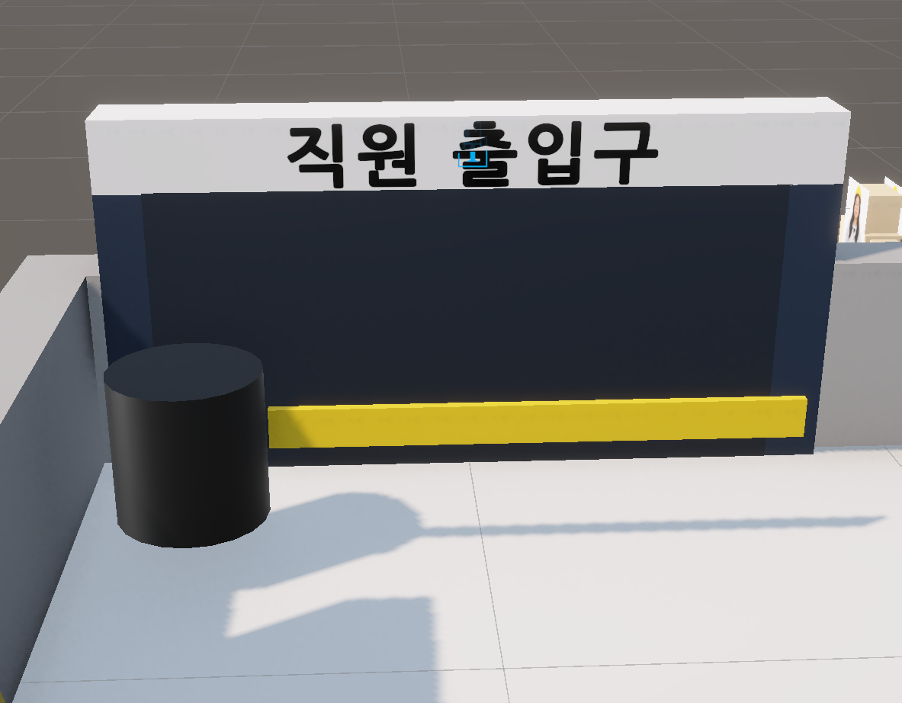

# 03. Features

## 공통 관제 영역

초기 기능별 독립 화면을 Top·Left·Right·Bottom 공통 영역과 중앙 View 구조로 개선했습니다. View를 전환해도 선택 로봇, 최신 상태, 카메라와 운영 로그가 유지됩니다.

| 영역 | 기능 |
|:---|:---|
| Top | 연결 상태, 출입·안전 이벤트와 운영 요약 |
| Left | View 이동, TB3-01·02·03 선택과 선택 로봇 상태 |
| Right | 최근 이벤트, 수동 주행, 긴급정지, 복귀와 지게차 제어 |
| Bottom | Global·TB3-01·TB3-02 카메라 Preview와 운영 로그 |
| Center | Dashboard / Factory / Robot / Map Status / Camera View |

## Dashboard View

로봇, 출입, 카메라, 서버 상태와 최근 이벤트를 요약합니다. 미수신 항목은 임의 값 대신 `--`로 표시합니다.

  

### 출퇴근 Dashboard 반복 시연

https://github.com/user-attachments/assets/15cd6972-5d16-48b5-b89f-1d41d69ab26f

## Factory View

2D 화면은 로봇·이벤트 위치와 Global CCTV를 비교하고, 3D 화면은 공장 설비·팔레트·컨베이어와 로봇의 공간 배치를 보여 줍니다.

<table>
  <tr>
    <td width="50%" align="center"></td>
    <td width="50%" align="center"></td>
  </tr>
</table>

## Robot View

- 선택 로봇 Pose·상태·배터리·속도·명령 결과
- 3D 로봇 Preview
- 순찰 시작·임무 재개·충전소 복귀
- 긴급정지와 초기화
- 수동 모드 진입·종료와 전·후·좌·우·정지
- TB3-03 리프트 상승·하강·정지
- HTTP 응답과 ACK·후속 상태 분리

  

### 수동 제어 반복 시연

https://github.com/user-attachments/assets/c38b458e-9647-4bce-87e5-747e6ff19b0d

## Map Status View

Pose·Route·Waypoint를 한 지도에서 추적하고 완료·현재·다음 Waypoint와 진행·예정 Segment를 구분합니다. Nav2 상태, 장애물과 복구 정보를 함께 표시합니다.

  

### 경로 순회 반복 시연

https://github.com/user-attachments/assets/465596d7-928e-441c-9b2a-bd62e33d4d51

## Camera View

Global CCTV와 TB3-01·TB3-02 카메라를 분리하고, 소켓 연결 여부와 마지막 실제 JPEG 프레임 적용 시각을 별도로 관리합니다.

  

### TB3 카메라 이벤트 반복 시연

https://github.com/user-attachments/assets/abf99c4f-91f6-4f09-8f8d-340b5be8d542

## Safety Event Popup

서버 이벤트 수신 시 유형, 발생 구역·시각, 감지 카메라·관련 로봇, 신뢰도와 Snapshot 상태를 Popup에 표시합니다. 확인·조치 결과는 이벤트 목록과 운영 로그에 반영합니다.

### 안전모 경고 반복 시연

https://github.com/user-attachments/assets/599035df-7030-4564-a839-721dec894f8e

### Global Camera 화재·쓰러짐 반복 시연

https://github.com/user-attachments/assets/034eb3ea-953e-4aa9-b50d-6c9d7d8cb8c5

## 출입 현황

직원·방문자 이벤트는 최근 출입 상태와 2D·3D 인원 Marker에 반영하고, 전체 집계는 서버의 Today Summary 값을 사용합니다.

## TB3-03 리프트와 팔레트

리프트 UI는 TB3-03에서만 사용하며 서버가 승인한 명령을 기준으로 Unity 모델의 상승·하강 상태를 표시합니다. 실제 연속 높이·하중 센서값을 복제하는 구조는 아닙니다.

팔레트는 감지, 부착, 운반과 Drop Slot 배치 상태를 관리합니다. 부모 Transform과 Rigidbody 전환 시점을 분리하고 위치·회전을 보간해 운반 자세를 안정화했습니다.

## 3D 모델링과 Unity 적용

Blender와 Unity에서 TB3, 지게차, 탑재 부품, 공장 설비와 안전 이벤트 오브젝트를 제작하거나 수정·통합했습니다. 아래 이미지는 대표 README에서 다루지 않은 세부 제작 기록입니다.

<table>
  <tr>
    <td width="50%" align="center"> <strong>Pi Camera</strong></td>
    <td width="50%" align="center"> <strong>Raspberry Pi</strong></td>
  </tr>
  <tr>
    <td width="50%" align="center"> <strong>OpenCR</strong></td>
    <td width="50%" align="center"> <strong>출입구 바리게이트</strong></td>
  </tr>
</table>

전체 편집 영상과 반복 영상은 [시연 영상](demo/README.md)에서 확인할 수 있습니다.

---

[문서 목차](README.md) · [프로젝트 README](../README.md)
