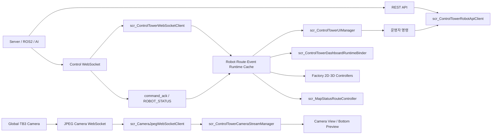
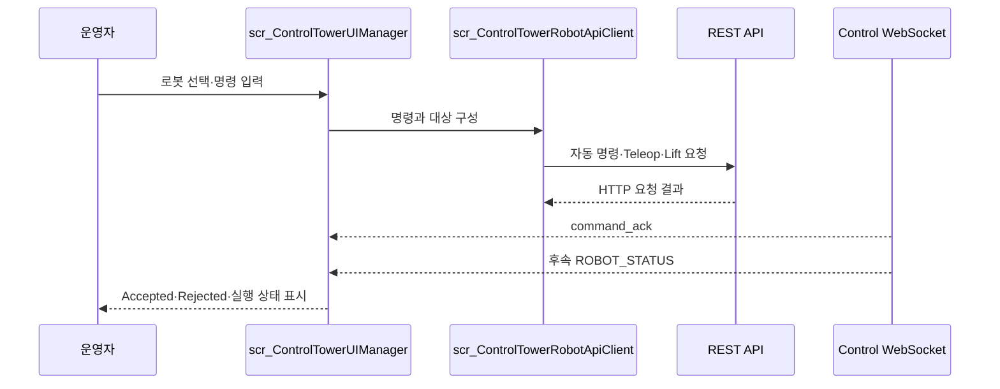

# 04. Data Flow

## 전체 Runtime 흐름



외부 데이터는 통신 방식별 Client에서 수신한 뒤 로봇·경로·이벤트 상태로 분리해 저장합니다. 각 View는 같은 Runtime 상태를 참조하며, 화면 전환이나 부분 메시지 수신으로 기존 정상 값이 지워지지 않도록 마지막 유효 값을 유지합니다.

## 1. 로봇 상태·경로 흐름

```text
/ws/control-tower
→ scr_ControlTowerWebSocketClient
→ ROBOT_STATUS·Route·Waypoint·AI·출입 이벤트 파싱
→ 로봇별 Runtime Cache 갱신
→ Dashboard·Factory·Robot·Map Status View 반영
```

| 단계 | 주요 데이터 | Unity 처리 |
|:---|:---|:---|
| 상태 수신 | `robot_id`, Pose, yaw, battery, velocity, status | 선택 로봇과 로봇별 상태 Cache 갱신 |
| 경로 수신 | Route, 현재·다음·완료 Waypoint | 기존 Route를 보호하면서 경로 정보만 분리 갱신 |
| 이벤트 수신 | AI 안전 이벤트, 출입 현황, Timeline | Popup·Snapshot·최근 이벤트·운영 로그 반영 |
| 화면 표시 | Robot·Route·Event Runtime State | Dashboard, Factory, Robot, Map Status가 공통 상태 참조 |

ROS 좌표는 Unity 좌표로 변환한 뒤 2D·3D Marker와 공장 구역에 적용합니다. View를 다시 열 때도 로봇별 마지막 유효 Pose를 즉시 복원해 첫 프레임 위치 초기화를 방지합니다.

## 2. 카메라 프레임 흐름

```text
/ws/video/global · /ws/video/1 · /ws/video/2
→ scr_CameraJpegWebSocketClient
→ JPEG Decode
→ Texture2D 갱신
→ scr_ControlTowerCameraStreamManager
→ Main Feed·TB3-01 Preview·TB3-02 Preview 반영
```

| 소스 | 표시 위치 | 상태 기준 |
|:---|:---|:---|
| Global CCTV | Main Feed 선택 항목 | 마지막 실제 JPEG 프레임 적용 시각 |
| TB3-01 | Main Feed·하단 Preview | 연결 상태와 실제 프레임 상태 분리 |
| TB3-02 | Main Feed·하단 Preview | 연결 상태와 실제 프레임 상태 분리 |
| TB3-03 | 영상 집계 제외 | 지게차 로봇으로 Camera View 스트림 미사용 |

WebSocket 연결만으로 영상을 정상으로 판단하지 않습니다. 마지막 실제 JPEG 프레임이 Texture에 적용된 시점을 별도로 추적해 연결 상태와 화면 표시 상태를 구분합니다.

## 3. 운영자 명령·응답 흐름



| 명령 영역 | 주요 요청 | 최종 상태 반영 |
|:---|:---|:---|
| 자동 운용 | `PATROL_START`, `RESUME`, Return Charger, Reset | `command_ack`와 후속 `ROBOT_STATUS` |
| 안전 제어 | Emergency Stop | ACK·로봇 FSM·운영 로그 |
| 수동 주행 | Manual Enter/Exit, Forward·Backward·Left·Right | 반복 Teleop 요청과 수신 상태 |
| 수동 정지 | `MANUAL_STOP` | Pointer Up·Hold 종료 시 STOP 요청 |
| 지게차 | Lift Up·Down·Stop | TB3-03 명령 결과와 Runtime 표시 |

HTTP 요청 성공은 서버가 요청을 받았다는 의미로 구분합니다. 화면 상태는 요청 직후 임의로 확정하지 않고 `command_ack`와 후속 `ROBOT_STATUS`를 기준으로 갱신합니다.

## 4. 주요 스크립트 연결

| 계층 | 스크립트 | 역할 |
|:---|:---|:---|
| REST Bridge | `scr_ControlTowerRobotApiClient` | 자동 명령·Teleop·Lift 요청 |
| Control WebSocket | `scr_ControlTowerWebSocketClient` | 로봇·경로·이벤트·ACK 수신 |
| Camera Bridge | `scr_CameraJpegWebSocketClient` | JPEG 프레임 수신·Decode·Texture 변환 |
| Camera Manager | `scr_ControlTowerCameraStreamManager` | 카메라 소스와 Main Feed·Preview 연결 |
| UI Core | `scr_ControlTowerUIManager` | View 전환·선택 로봇·명령·상태 표시 연결 |
| Dashboard Core | `scr_ControlTowerDashboardRuntimeBinder` | Runtime 상태를 Dashboard 카드에 반영 |
| Map UI | `scr_MapStatusRouteController` | Route·Waypoint·진행 상태 표시 |
| Factory UI | Factory 2D·3D Controller | 로봇·인원·팔레트·설비 위치 시각화 |

---

[문서 목차](README.md) · [프로젝트 README](../README.md)
