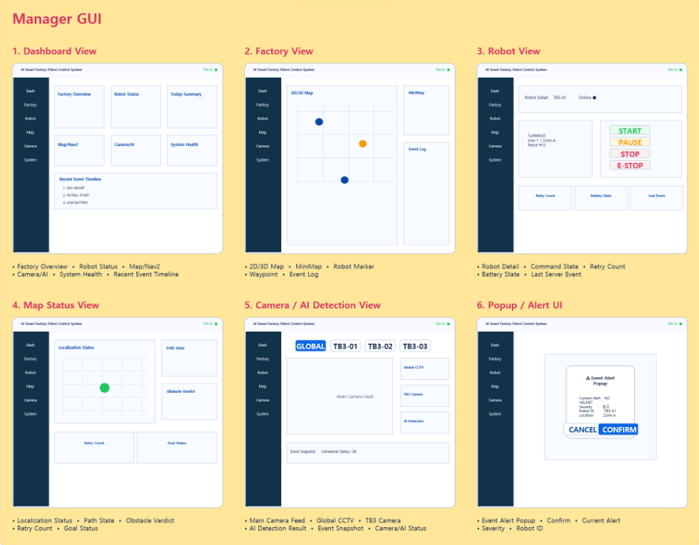

# 06. Project Scope

## 주요 문제 해결

| 문제 | 원인 | 해결 | 결과 |
|:---|:---|:---|:---|
| View 재진입 시 로봇 위치 초기화 | 비활성 View가 새 상태 메시지를 기다림 | 로봇별 마지막 유효 Pose 보관과 활성화 즉시 복원 | 첫 프레임부터 최근 실제 위치 표시 |
| 부분 상태 메시지로 Route 소실 | 누락 필드를 빈 배열로 해석 | 일반 상태와 Route·Waypoint 갱신 분리 | 기존 정상 경로 유지 |
| 연결 상태와 실제 영상 불일치 | WebSocket 연결만으로 정상 판정 | 마지막 실제 JPEG 프레임 적용 시각 추적 | 사용자가 보는 영상 기준 상태 표시 |
| TB3 카메라 Texture 혼선 | Main Feed와 고정 Preview가 소스 상태를 공유 | Client·Source Key·Texture와 Target 분리 | TB3-01·02 Preview 독립 표시 |
| 이벤트 좌표 해석 차이 | ROS 좌표와 Unity 레이아웃 표현이 다름 | 공통 좌표 변환과 구역 경계 적용 | 2D·3D Marker와 구역명 일치 |
| 누락값과 숫자 `0` 혼동 | 역직렬화 기본값과 실제 값 표현이 동일 | 필드 존재 여부와 수신 상태 분리 | 미수신과 유효 `0` 구분 |
| HTTP 성공과 실행 완료 혼동 | 전송 성공을 장치 상태로 즉시 반영 | Accepted·Rejected와 ACK·후속 상태 분리 | Optimistic Update 제거 |
| 팔레트 부착·해제 자세 불안정 | 부모 Transform과 Rigidbody 전환이 같은 시점에 적용 | 상태별 전환과 위치·회전 보간 | 픽업부터 Drop Slot까지 자세 안정화 |

  

초기 기능별 독립 화면을 공통 관제 영역과 중앙 View 구조로 바꾸어 화면 전환 중에도 로봇 상태, 이벤트, 카메라, 제어와 운영 로그가 유지되도록 개선했습니다.

## 최종 구현 범위

### 화면

- Dashboard View
- Factory View 2D·3D
- Robot View
- Map Status View
- Camera View
- Safety Event Popup
- 공통 Top·Left·Right·Bottom 관제 영역

### 실시간 데이터

- 로봇 Pose·방향·배터리·속도·상태
- Route·Waypoint·Nav2·장애물·복구 상태
- Global·TB3-01·TB3-02 카메라
- AI 이벤트·Snapshot·출입 정보
- Server·WebSocket·ROS2·AI 시스템 상태
- 명령 ACK와 순찰 Timeline·Log

### 운영자 제어

- 순찰 시작
- 임무 재개
- 충전소 복귀
- 긴급정지
- 초기화
- 수동 모드 진입·종료
- 전진·후진·좌·우·정지
- TB3-03 리프트 상승·하강·정지

### Factory Runtime

- 2D·3D 로봇 Marker
- 직원·방문자 Marker
- 출입구 차단기
- 컨베이어 동작
- TB3-03 리프트
- 팔레트 감지·부착·운반·Drop Slot 배치

---

[문서 목차](README.md) · [프로젝트 README](../README.md)
