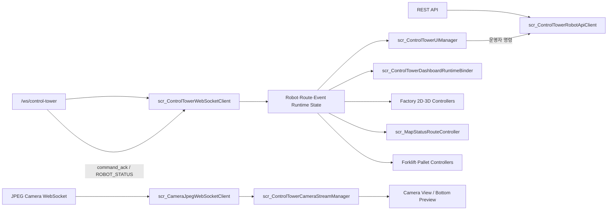

# 07. Project Structure

## 공통 ControlTower UI 폴더

개인 포트폴리오 저장소와 팀 통합 저장소의 `controltower_ui`는 아래 콘텐츠를 동일하게 관리합니다.

```text
.
├─ README.md
├─ docs/
│  ├─ README.md
│  ├─ 01_overview.md
│  ├─ 02_architecture.md
│  ├─ 03_features.md
│  ├─ 04_data_flow.md
│  ├─ 05_validation.md
│  ├─ 06_project_scope.md
│  ├─ 07_project_structure.md
│  ├─ demo/
│  │  └─ README.md
│  └─ images/
│     ├─ overview/
│     ├─ features/
│     ├─ modeling/
│     └─ troubleshooting/
└─ src/
   ├─ README.md
   ├─ DEPENDENCIES.md
   ├─ SCRIPT_INDEX.md
   └─ Unity/ControlTower/
      ├─ Bridge/
      ├─ Core/
      └─ UI/
```

| 경로 | 역할 |
|:---|:---|
| `README.md` | 프로젝트 핵심 결과·시연·화면·기술 요약 |
| `docs` | Overview부터 Project Structure까지 상세 문서와 이미지 |
| `src/Unity/ControlTower/Bridge` | REST·Control WebSocket·Camera WebSocket 연동 |
| `src/Unity/ControlTower/Core` | Runtime 상태·View 전환·Dashboard 연결 |
| `src/Unity/ControlTower/UI` | Factory·Map·Marker·Conveyor·Forklift·Pallet 시각화 |

## Unity C# 연결 구조



Bridge는 외부 데이터를 수신하고 Core는 로봇·경로·이벤트 상태와 View를 연결합니다. UI 계층은 공통 Runtime 상태를 Factory, Map Status, Camera와 지게차·팔레트 화면에 반영합니다.

## 전체 Unity C# 스크립트

| 영역 | 스크립트 | 역할 |
|:---|:---|:---|
| Bridge | `scr_CameraJpegWebSocketClient.cs` | JPEG Camera WebSocket 수신과 Texture 변환 |
| Bridge | `scr_ControlTowerCameraStreamManager.cs` | Global·TB3 카메라 소스와 Feed·Preview 연결 |
| Bridge | `scr_ControlTowerRobotApiClient.cs` | 자동 명령·Teleop·Lift REST 요청 |
| Bridge | `scr_ControlTowerWebSocketClient.cs` | 로봇·경로·이벤트·명령 결과 WebSocket 수신 |
| Core | `scr_ControlTowerDashboardRuntimeBinder.cs` | Runtime 상태를 Dashboard 카드에 반영 |
| Core | `scr_ControlTowerUIManager.cs` | View·선택 로봇·명령·상태 표시의 중심 제어 |
| UI | `scr_Factory2DPalletMarkerController.cs` | Factory 2D 팔레트 Marker 표시 |
| UI | `scr_Factory2DPeopleMarkerController.cs` | Factory 2D 직원·방문자 Marker 표시 |
| UI | `scr_Factory3DMapCameraController.cs` | Factory 3D 카메라 전환과 시점 제어 |
| UI | `scr_Factory3DRobotMarkerController.cs` | Factory 3D 로봇 위치·방향 표시 |
| UI | `scr_FactoryConveyorRuntimeController.cs` | 컨베이어 Runtime 동작 표시 |
| UI | `scr_FactoryFull2DMapController.cs` | Factory 전체 2D 지도와 Marker 표시 |
| UI | `scr_FactoryMini2DMapController.cs` | Factory MiniMap과 Marker 표시 |
| UI | `scr_MapStatusRouteController.cs` | Route·Waypoint와 Map Status 표시 |
| UI | `scr_Personnel3DMarkerController.cs` | 직원·방문자 3D Marker 표시 |
| UI | `scr_StaffEntranceBarrierController.cs` | 출입구 바리게이트 상태 표시 |
| UI | `scr_TB3ForkliftPalletCarryController.cs` | TB3-03 지게차와 팔레트 운반 흐름 연결 |
| UI | `scr_TB3ForkliftRuntimeController.cs` | TB3-03 리프트 Runtime 상태 표시 |
| UI | `scr_TB3PalletCarryController.cs` | 팔레트 부착·운반·배치 상태 표시 |

총 C# 스크립트는 **19개**이며, Bridge·Core·UI 영역으로 구성합니다.
