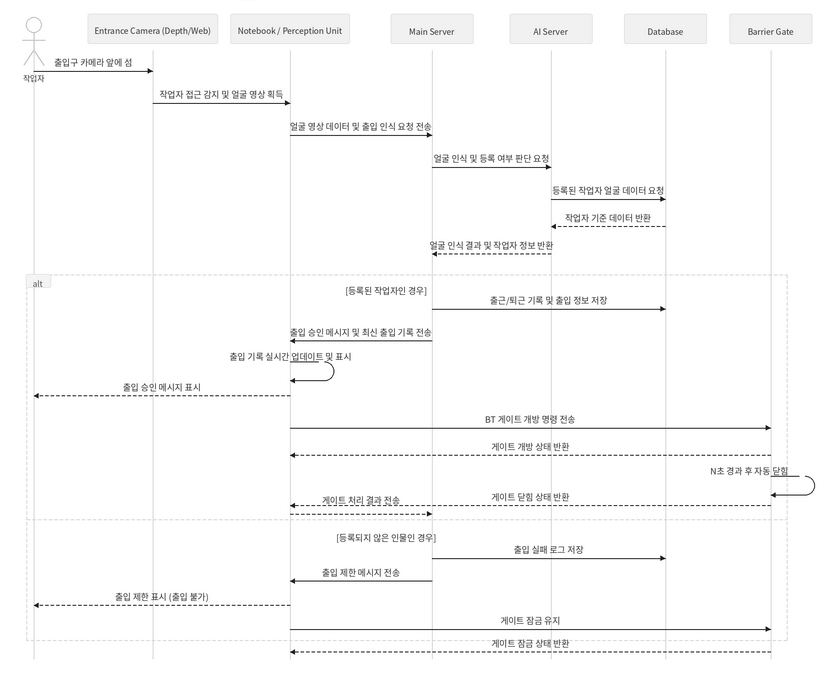
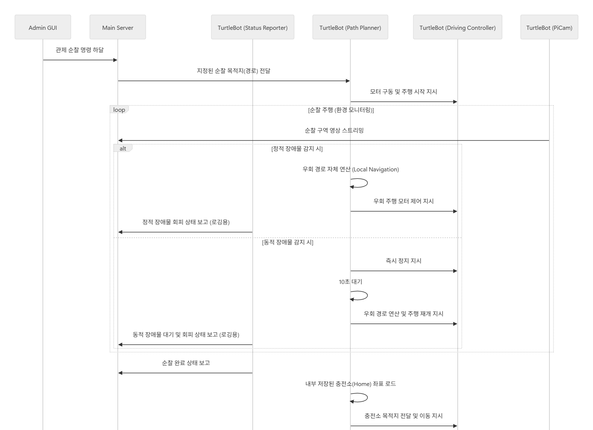
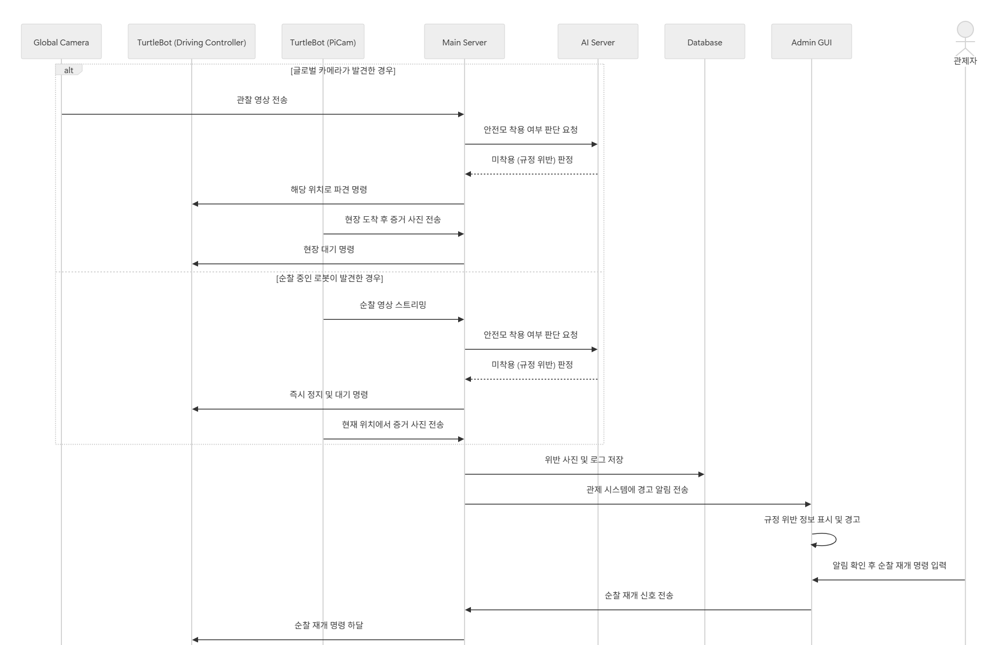
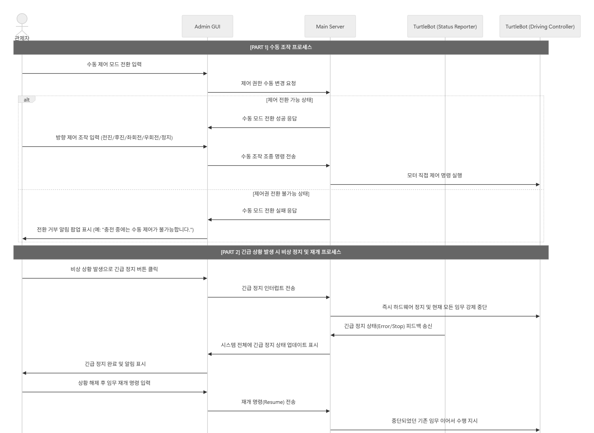

# 시퀀스 다이어그램

아래 이미지는 발표 자료에서 사용한 주요 시나리오 시퀀스 다이어그램입니다. 루트 README에는 전부 넣지 않고, 이 문서에서 상세 흐름을 확인하도록 구성합니다.

## Scenario 1. 작업자 출퇴근 얼굴 인식

## Scenario 2. 물류센터 순찰

## Scenario 3. 안전모 미착용 감지 (위반사항)

## Scenario 4. 응급 사항 감지 (화재, 작업자 쓰러짐)

## Scenario 5. 자동 충전

## Scenario 6. 관제 서버 수동 조작 및 긴급 정지

