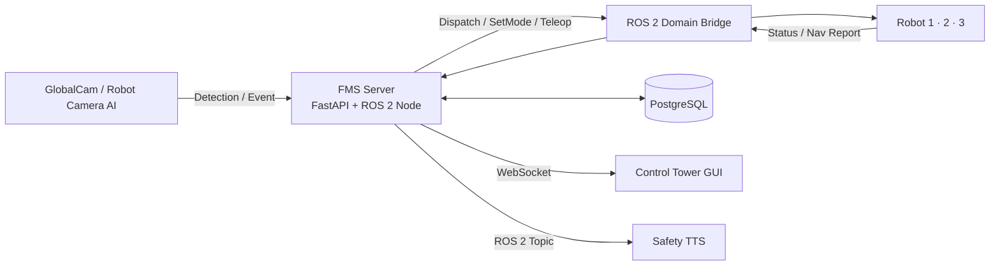
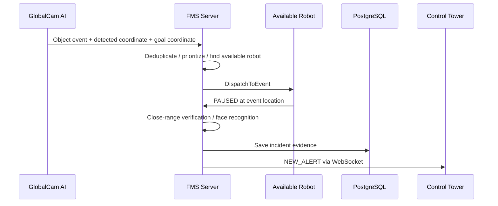

# 🏭 FMS Control Server & Database

> AI 객체인식, 다중 자율주행 로봇, 관제 GUI, PostgreSQL을 연결하는
> 스마트 팩토리 통합 관제·이벤트 오케스트레이션 서버

`FastAPI` · `ROS 2 Jazzy` · `PostgreSQL` · `WebSocket` · `Domain Bridge`

---

## Overview

FMS(Factory Management System) 서버는 AI가 감지한 현장 이벤트를 받아 로봇의 상태를 판단하고, 적절한 로봇을 배차하며, 사건 기록과 관제 알림을 일관되게 처리합니다.

단순한 API 서버가 아니라 **AI 비전 · 로봇 제어 · 데이터베이스 · 관제 UI를 연결하는 운영 판단 계층**입니다.

## Architecture



## Core Features

| Feature | Description |
| --- | --- |
| **Multi-robot monitoring** | 로봇 1·2·3호기의 상태, 배터리, 좌표, 순찰 진행도, 내비게이션 정보를 통합 수집 |
| **Intelligent dispatch** | 글로벌캠 이벤트 발생 시 위험도, 로봇 상태, 거리, 진행 중 임무를 고려해 가용 로봇을 배차 |
| **Event queue** | 가용 로봇이 없으면 대기 큐에 보관하고, 중복 이벤트를 억제한 뒤 1초 주기로 재배차 |
| **Incident evidence** | 화재, 쓰러짐, 안전모 미착용 사건에 대해 로봇 ID, 위치, 이미지, AI 상세 정보, 처리 상태를 DB에 저장 |
| **Face-linked safety** | 안전모 미착용 이벤트에서 얼굴인식 사번을 연계하고, 인식 실패도 NULL 기록으로 보존 |
| **Patrol handover** | 이벤트 대응·충전으로 순찰을 이탈한 로봇의 임무를 다른 가용 로봇으로 교대 |
| **Real-time control** | REST API, ROS 2 Service, WebSocket으로 관제 명령·상태·사고 알림을 실시간 처리 |

## Event Processing Flow



## Technology Stack

| Area | Technology |
| --- | --- |
| Backend | FastAPI, asyncio, Uvicorn |
| Robot middleware | ROS 2 Jazzy, rclpy, CycloneDDS |
| Multi-domain communication | ROS 2 Domain Bridge |
| Database | PostgreSQL, SQLAlchemy, Alembic |
| Real-time delivery | WebSocket, ROS 2 Topic / Service |
| Perception integration | GlobalCam, Robot Camera, YOLO-based detection |

## Repository Structure

```text
server_db/
├── backend/                  # FastAPI application
│   ├── app/api/               # REST API routers
│   ├── app/services/          # ROS 2 client, event triage, dispatch logic
│   ├── app/db/                # SQLAlchemy models and database connection
│   ├── app/core/              # WebSocket manager and common exceptions
│   └── alembic/               # Database migration history
├── domain_bridge_ws/          # Domain Bridge C++ source workspace
│   └── src/teamproject_interfaces/
├── config/                    # ROS 2 interface references and calibration
└── docs/                      # Integration notes
```

## Quick Start

### 1. Build ROS 2 interfaces and Domain Bridge

```bash
cd server_db/domain_bridge_ws
source /opt/ros/jazzy/setup.bash
colcon build --symlink-install
source install/setup.bash
```

### 2. Configure the backend environment

```bash
cd ../backend
cp .env.example .env
# Edit DATABASE_URL in .env
pip install -r requirements.txt
```

### 3. Run the API server

```bash
source /opt/ros/jazzy/setup.bash
source ../domain_bridge_ws/install/setup.bash
uvicorn main:app --host 0.0.0.0 --port 8000
```

> ROS 2 Python dependencies such as `rclpy` are provided by the ROS 2 installation, not pip.

## Main Interfaces

- **REST API**: 직원·방문자·출입·사고·로봇 명령·대시보드 조회
- **WebSocket**: `ROBOT_STATUS`, `NAV_REPORT`, `CAMERA_AI_STATUS`, `NEW_ALERT`
- **ROS 2 Service**: `SetMode`, `DispatchToEvent`
- **ROS 2 Topic**: 로봇 상태, 내비게이션 리포트, 안전 감지, 글로벌캠 이벤트, TTS

상세 메시지·서비스 정의는 [`config/`](./config), Domain Bridge 빌드 소스는 [`domain_bridge_ws/`](./domain_bridge_ws)를 참고하세요.

## Security and Local Assets

이 저장소에는 DB 비밀번호, 얼굴 등록 이미지·임베딩, 사고 캡처 이미지, 모델 가중치, 빌드 산출물을 포함하지 않습니다. 로컬 환경에서는 `.env.example`을 기반으로 환경 변수를 설정해야 합니다.

---

Built for the Eduwing Robotics smart factory project.
