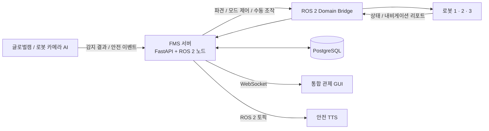
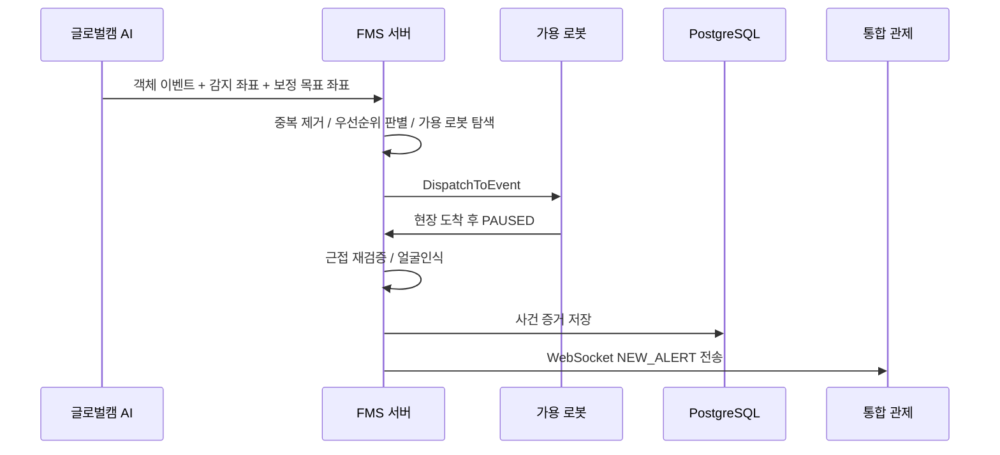

# 🏭 FMS 관제 서버 및 데이터베이스

> AI 객체인식, 다중 자율주행 로봇, 관제 GUI, PostgreSQL을 연결하는
> 스마트 팩토리 통합 관제·이벤트 오케스트레이션 서버

`FastAPI` · `ROS 2 Jazzy` · `PostgreSQL` · `WebSocket` · `Domain Bridge`

---

## 프로젝트 개요

FMS(Factory Management System) 서버는 AI가 감지한 현장 이벤트를 받아 로봇 상태를 판단하고, 적절한 로봇을 배차하며, 사건 기록과 관제 알림을 일관되게 처리합니다.

단순한 API 서버가 아니라 **AI 비전 · 로봇 제어 · 데이터베이스 · 관제 UI를 연결하는 운영 판단 계층**입니다.

담당: 유예린

## 시스템 구조



## 주요 기능

| 기능 | 설명 |
| --- | --- |
| **다중 로봇 모니터링** | 1·2·3호기 상태, 배터리, 좌표, 순찰 진행도, 내비게이션 정보를 통합 수집 |
| **지능형 배차** | 글로벌캠 이벤트 발생 시 위험도, 로봇 상태, 거리, 진행 중 임무를 고려해 가용 로봇 배차 |
| **이벤트 큐** | 가용 로봇이 없으면 대기 큐에 보관하고 중복 이벤트를 억제한 뒤 주기적으로 재배차 |
| **사건 증거 관리** | 화재·쓰러짐·안전모 미착용 사건의 로봇 ID, 좌표, 이미지, AI 상세 정보, 처리 상태를 DB에 저장 |
| **얼굴인식 연계 안전 관리** | 안전모 미착용 이벤트에 얼굴인식 사번을 연계하고, 인식 실패도 NULL 기록으로 보존 |
| **순찰 임무 교대** | 이벤트 대응·충전으로 순찰을 이탈한 로봇의 임무를 다른 가용 로봇에 교대 |
| **실시간 관제 제어** | REST API, ROS 2 서비스, WebSocket으로 관제 명령·상태·사고 알림을 실시간 처리 |

## 이벤트 처리 흐름



## 기술 스택

| 구분 | 기술 |
| --- | --- |
| 백엔드 | FastAPI, asyncio, Uvicorn |
| 로봇 미들웨어 | ROS 2 Jazzy, rclpy, CycloneDDS |
| 다중 도메인 통신 | ROS 2 Domain Bridge |
| 데이터베이스 | PostgreSQL, SQLAlchemy, Alembic |
| 실시간 전송 | WebSocket, ROS 2 토픽 / 서비스 |
| 인식 연동 | 글로벌캠, 로봇 카메라, YOLO 기반 객체인식 |

## 폴더 구조

```text
server_db/
├── backend/                  # FastAPI 애플리케이션
│   ├── app/api/               # REST API 라우터
│   ├── app/services/          # ROS 2 클라이언트, 이벤트 판별·배차 로직
│   ├── app/db/                # SQLAlchemy 모델과 DB 연결
│   ├── app/core/              # WebSocket 매니저와 공통 예외
│   └── alembic/               # DB 마이그레이션 이력
├── domain_bridge_ws/          # Domain Bridge C++ 소스 워크스페이스
│   └── src/teamproject_interfaces/
├── config/                    # 글로벌캠 보정값과 공유 설정
└── docs/                      # 상세 기술 문서
```

## 빠른 시작

### 1. ROS 2 인터페이스와 Domain Bridge 빌드

```bash
cd server_db/domain_bridge_ws
source /opt/ros/jazzy/setup.bash
colcon build --symlink-install
source install/setup.bash
```

### 2. 백엔드 환경 설정

```bash
cd ../backend
cp .env.example .env
# .env의 DATABASE_URL을 환경에 맞게 수정
pip install -r requirements.txt
```

### 3. API 서버 실행

```bash
source /opt/ros/jazzy/setup.bash
source ../domain_bridge_ws/install/setup.bash
uvicorn main:app --host 0.0.0.0 --port 8000
```

> `rclpy` 등 ROS 2 파이썬 의존성은 pip가 아닌 ROS 2 설치 환경에서 제공합니다.

## 주요 인터페이스

- **REST API**: 직원·방문자·출입·사고·로봇 명령·대시보드 조회
- **WebSocket**: `ROBOT_STATUS`, `NAV_REPORT`, `CAMERA_AI_STATUS`, `NEW_ALERT`
- **ROS 2 서비스**: `SetMode`, `DispatchToEvent`
- **ROS 2 토픽**: 로봇 상태, 내비게이션 리포트, 안전 감지, 글로벌캠 이벤트, TTS

상세 메시지·서비스 정의는 [`config/`](./config), Domain Bridge 빌드 소스는 [`domain_bridge_ws/`](./domain_bridge_ws)를 참고하세요.

## 보안 및 로컬 실행 자산

이 저장소에는 DB 비밀번호, 얼굴 등록 이미지·임베딩, 사고 캡처 이미지, 모델 가중치, 빌드 산출물을 포함하지 않습니다. 로컬 환경에서는 `.env.example`을 기반으로 환경 변수를 설정해야 합니다.

## 기술 문서

- [문서 목차](docs/README.md)
- [시스템 아키텍처](docs/01-architecture.md)
- [데이터베이스 설계 및 ERD](docs/02-database-design.md)
- [ROS 2·Domain Bridge 연동](docs/03-ros-integration.md)
- [AI 이벤트·로봇 파견 로직](docs/04-event-dispatch.md)
- [API·WebSocket 인터페이스](docs/05-api-interface.md)

---

Eduwing Robotics 스마트 팩토리 팀 프로젝트를 위해 제작했습니다.
