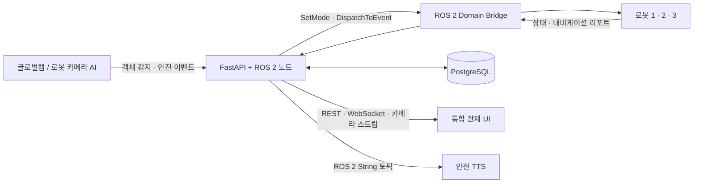

# 01. 시스템 아키텍처

## FMS 서버의 역할

FMS(Factory Management System) 서버는 AI 인식, 로봇, 데이터베이스, 통합 관제 UI 사이의 오케스트레이션 계층입니다. 이벤트와 로봇 텔레메트리를 수신하고, 가용 로봇을 선택·제어하며, 운영 증거를 저장하고, 관제 화면에 실시간 정보를 전달합니다.

## 이기종 동시성 구조

FastAPI는 asyncio 이벤트 루프를, ROS 2는 블로킹 방식의 `rclpy.spin()` 콜백 루프를 사용합니다. 백엔드는 FastAPI의 lifespan 훅에서 전용 백그라운드 스레드로 ROS 2 노드를 실행합니다.

1. FastAPI가 시작되면서 실행 중인 asyncio 루프를 보관합니다.
2. `FactoryRosAiNode`를 생성하고 데몬 스레드에서 `rclpy.spin()`으로 처리합니다.
3. ROS 콜백은 WebSocket 연결을 직접 건드리지 않고 전송할 페이로드만 준비합니다.
4. `loop.call_soon_threadsafe()`로 FastAPI 루프에 비동기 브로드캐스트 작업을 예약합니다.

이 구조를 통해 API 응답·WebSocket 전송과 ROS 콜백 처리를 분리하면서도, 로봇 상태·AI 경보·카메라 프레임을 안전하게 전달합니다.

## 주요 구현 지점

| 구분 | 구현 위치 |
| --- | --- |
| 애플리케이션 생명주기 | `backend/main.py`의 FastAPI lifespan |
| ROS 2 구독·서비스 | `app/services/ros_client.py`, `ros_client_ai.py` |
| WebSocket 연결 관리 | `app/core/websocket.py` |
| 데이터베이스 접근 | SQLAlchemy 모델과 CRUD 모듈 |
| 스키마 마이그레이션 | Alembic |

인터페이스는 [ROS 2·Domain Bridge 연동](03-ros-integration.md), 관제 클라이언트 전달 방식은 [API·WebSocket 인터페이스](05-api-interface.md)를 참고하세요.
