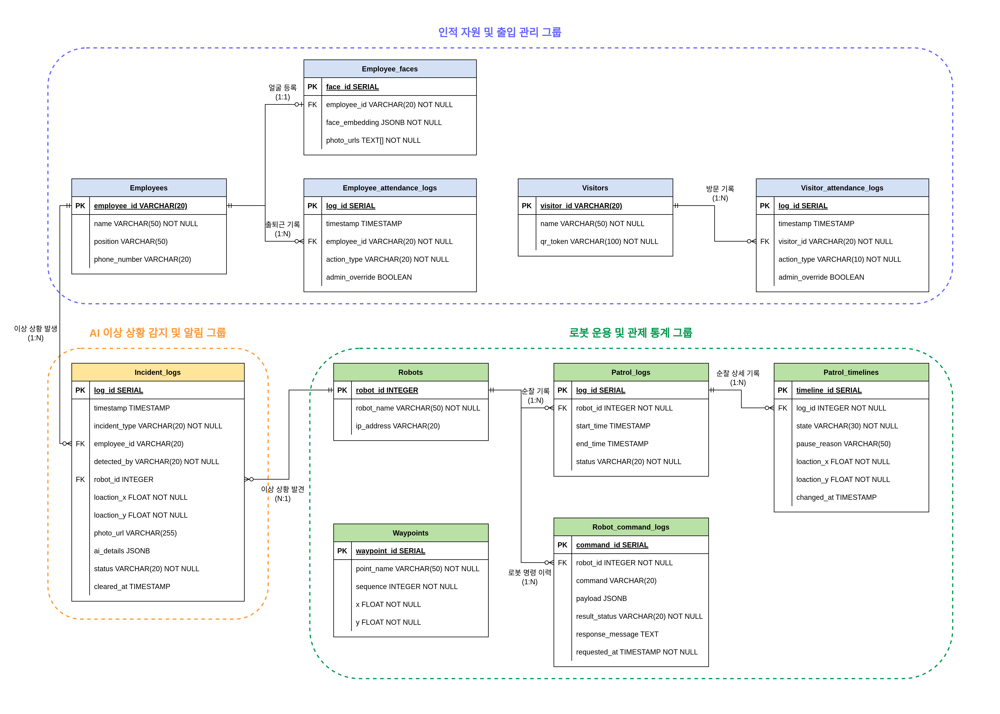

# 02. 데이터베이스 설계 및 ERD

## ERD

데이터베이스는 인원·출입 관리, AI 안전 사건 증거, 로봇 운용 이력으로 나뉩니다. AI 결과나 명령 인자처럼 이벤트별로 달라질 수 있는 데이터는 PostgreSQL JSONB로 저장합니다.

## 테이블 그룹

| 그룹 | 테이블 | 역할 |
| --- | --- | --- |
| 인원·출입 관리 | `employees`, `employee_faces`, `employee_attendance_logs` | 직원 정보, 얼굴 임베딩 메타데이터, 출퇴근 이력 |
| 방문자 출입 | `visitors`, `visitor_attendance_logs` | QR 토큰 등록 정보와 입·퇴장 이력 |
| 안전 사건 | `incident_logs` | 화재·쓰러짐·안전모 미착용 증거, 좌표, 이미지 경로, AI 상세 정보, 처리 상태 |
| 로봇 운용 | `robots`, `waypoints`, `patrol_logs`, `patrol_timelines`, `robot_command_logs` | 로봇 정보, 순찰 경로, 상태 전환, 주요 제어 명령 이력 |

## 주요 관계

- `employee_faces.employee_id`는 `employees.employee_id`를 참조하며, 직원 한 명당 하나의 얼굴 등록 정보를 가집니다.
- 출입·안전 사건 이력은 신원이 확인된 경우 직원 정보를 참조합니다.
- `incident_logs.robot_id`는 증거를 제공했거나 근거리 재검증을 수행한 로봇을 나타냅니다.
- 하나의 순찰 로그는 여러 개의 타임라인 레코드를 가지므로 관제 화면에서 상태 전환 이력을 복원할 수 있습니다.

## 사건 저장

사건이 확정되면 서버는 `incident_logs`에 다음 정보를 저장합니다.

- 사건 유형: `FIRE`, `FALL`, `NO_HELMET`
- 감지 출처: `GLOBAL_CAM` 또는 `ROBOT`, 관련 로봇 ID
- 맵 좌표와 선택적 증거 이미지 경로
- `ai_details`의 신뢰도·바운딩 박스 등 AI 상세 정보
- 안전모 미착용 시 얼굴인식으로 식별된 선택적 `employee_id`
- `NEW` / `CLEARED` 처리 상태

안전모 미착용에서 신원을 확인하지 못한 경우에도 `employee_id = NULL`로 한 건을 보존합니다. 얼굴인식 실패 때문에 안전 사건 기록이 사라지지 않도록 하기 위함입니다.

## 데이터 보호

얼굴 이미지·임베딩, DB 덤프, 런타임 `.env` 설정은 저장소에서 제외합니다. 공개용 백엔드는 `DATABASE_URL` 환경 변수로 DB 연결 문자열을 받습니다.
