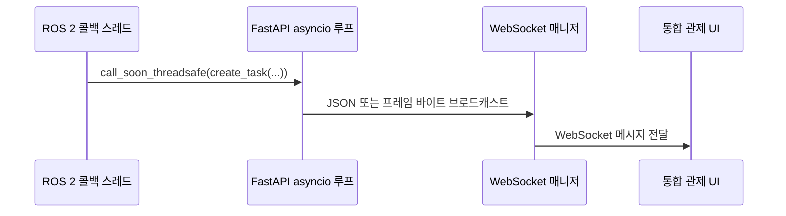

# 03. ROS 2·Domain Bridge 연동

## Domain Bridge를 사용하는 이유

로봇과 관제 PC는 서로 다른 `ROS_DOMAIN_ID`에서 동작할 수 있습니다. ROS 2의 기본 DDS 탐색 범위는 하나의 도메인에 한정되므로, Domain Bridge가 FMS에 필요한 토픽과 서비스만 선택적으로 중계합니다.

장점은 다음과 같습니다.

- 로봇별 DDS 트래픽을 분리하면서 필요한 제어·상태 전달 경로를 유지합니다.
- 하나의 서버 ROS 2 노드에서 여러 로봇을 관찰할 수 있습니다.
- `teamproject_interfaces`를 빌드해 커스텀 메시지와 서비스를 도메인 간 중계할 수 있습니다.

브릿지 설정은 [`../domain_bridge_ws/bridge_config.yaml`](../domain_bridge_ws/bridge_config.yaml)에, 커스텀 인터페이스 소스는 `src/teamproject_interfaces`에 있습니다.

## 주요 인터페이스

| 인터페이스 | 방향 | 용도 |
| --- | --- | --- |
| `/robot{n}/state` | 로봇 → 서버 | 상태, 배터리, 맵 좌표, 순찰 진행도 |
| `/robot{n}/nav_report` | 로봇 → 서버 | 내비게이션·경로 실행 정보 |
| `/robot{n}/safety/detections` | AI → 서버 | 로봇 카메라 프레임별 객체인식 후보 |
| `/robot{n}/server/safety_events` | AI → 서버 | 확정 근거리 안전 이벤트와 얼굴인식 결과 |
| `/globalcam/turtlebot_goal/coordinates` | 글로벌캠 → 서버 | 원근 보정된 로봇 파견 목표 좌표 |
| `/robot{n}/set_mode` | 서버 → 로봇 | 순찰·일시정지·재개·비상정지 등 모드 제어 |
| `/robot{n}/dispatch_to_event` | 서버 → 로봇 | 이벤트 유형과 목표 맵 좌표를 담은 파견 요청 |
| `/robot{n}/handover_request` | 로봇 → 서버 | 웨이포인트 기준 순찰 교대 요청 |

`{n}`은 로봇 ID입니다. 정확한 타입 정의는 `RobotStatus.msg`, `ObstacleVerdict.msg`, `SetMode.srv`, `DispatchToEvent.srv`에 있습니다.

## 관제 UI 전달 경로

ROS 콜백은 ROS 백그라운드 스레드에서 실행됩니다. 콜백은 FastAPI 측 브리지 콜백을 호출하고, 이 콜백이 `call_soon_threadsafe`로 asyncio 루프의 `manager.broadcast()` 또는 `video_manager.broadcast_video()`를 예약합니다.

따라서 ROS 스레드에서 비동기 WebSocket 메서드를 직접 호출하지 않습니다.

## TTS 토픽

모든 TTS 메시지는 `std_msgs/msg/String` 타입을 사용합니다.

| 토픽 | 의미 | data 값 |
| --- | --- | --- |
| `/fire` | 화재 경보 | 임의의 비어 있지 않은 문자열 |
| `/worker_down` | 작업자 쓰러짐 경보 | 임의의 비어 있지 않은 문자열 |
| `/helmet_missing` | 안전모 미착용 경고 | 사번. 예: `003` |
