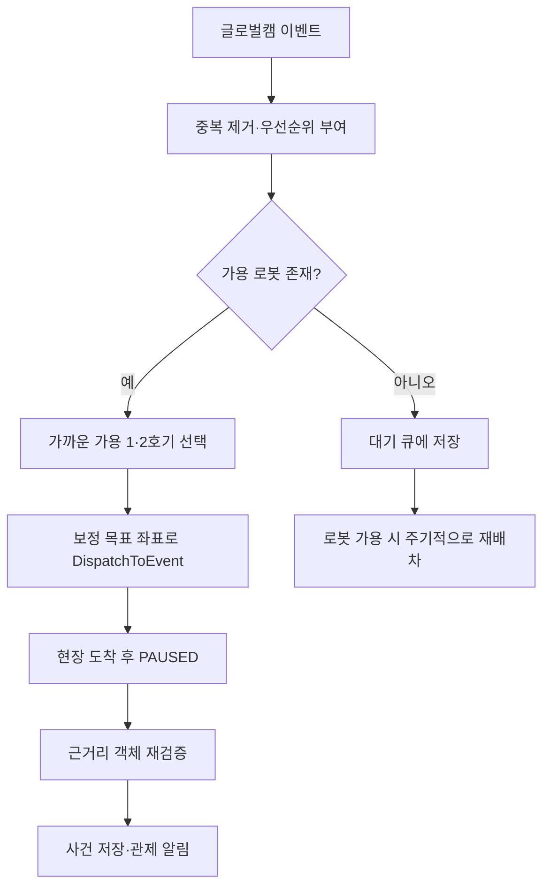

# 04. AI 이벤트·로봇 파견 로직

## 이벤트 수신과 우선순위

서버는 글로벌캠 이벤트와 로봇 카메라 안전 결과를 수신합니다. 글로벌캠 이벤트는 다음 우선순위로 큐에 정규화됩니다.

| 이벤트 | 우선순위 |
| --- | --- |
| 화재 | 3 |
| 쓰러짐 | 2 |
| 안전모 미착용 | 1 |

이벤트는 우선순위와 발생 시각으로 정렬됩니다. 같은 유형의 가까운 중복 이벤트는 억제하여, 연속된 AI 프레임이 반복 배차를 만들지 않도록 합니다.

## 목표 좌표와 증거 좌표의 분리

글로벌캠은 두 종류의 좌표를 제공할 수 있습니다.

- **감지 좌표**: 검출 객체에서 직접 산출한 위치이며, 사건 증거 좌표로 보존합니다.
- **목표 좌표**: `/globalcam/turtlebot_goal/coordinates`의 원근 보정 좌표이며, 값이 있으면 로봇 파견에 우선 사용합니다.

이렇게 분리해 로봇은 보정된 위치로 정확히 이동하고, DB에는 원래 감지된 객체 위치를 남길 수 있습니다.

## 배차 생명주기

서버는 로봇별 배차 출처, 목표 좌표, 원래 감지 좌표, 이벤트 유형을 추적합니다. 그래서 파견을 유발한 객체와 무관한 감지 결과가 사건으로 잘못 저장되는 것을 막습니다.

## 안전모 미착용 재검증

로봇이 이벤트 위치에서 `PAUSED` 상태가 된 후, 확정된 `/robot{n}/server/safety_events` 안전모 미착용 이벤트에는 얼굴인식 결과가 포함될 수 있습니다. 서버는 정해진 얼굴인식 대기 시간 동안 결과를 기다린 뒤 사건을 저장합니다.

- 사번 인식 성공: 해당 `employee_id`를 연결해 저장합니다.
- 미인식 또는 타임아웃: `employee_id = NULL`로 안전모 미착용 1건을 저장합니다.
- DB 저장 실패: 재시도 후 워크플로를 완료합니다.
- 사건 저장 후에도 로봇은 `PAUSED`를 유지하며, 관제사의 재개 명령으로만 순찰을 재개합니다.

## 순찰 임무 교대

로봇이 교대를 요청하면 서버는 다른 가용 로봇을 선택하고, 이어서 시작할 웨이포인트 인덱스를 포함한 파견 요청을 보냅니다. 글로벌캠 대응 임무가 완료된 로봇에 중복 교대가 발생하지 않도록, 관련 순찰 전환에서만 교대 로직을 활성화합니다.
