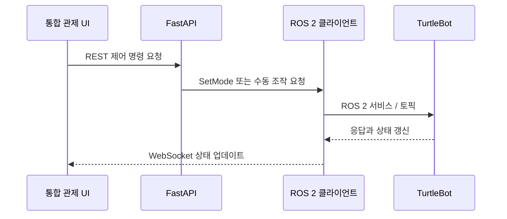

# 05. API·WebSocket 인터페이스

## REST API 그룹

FastAPI 애플리케이션은 관제 UI 운영 기능별 API 그룹을 제공합니다.

| 영역 | 기본 경로 | 예시 기능 |
| --- | --- | --- |
| 직원 | `/api/v1/employees` | 얼굴 등록 정보, 출입 상태, 얼굴 등록 |
| 출입 | `/api/v1/attendance` | 직원 출입 이력, 방문자 출입 기록 |
| 방문자 | `/api/v1/visitors` | QR 등록 정보, 현재 방문자 상태 |
| 로봇 제어 | `/api/v1/robots` | 모드 명령과 수동 조작 |
| 사건 | `/api/v1/incidents` | 사건 조회, 조치 완료, 테스트 경보 |
| 대시보드·로그 | `/api/v1` | 금일 요약, 출입·사건·순찰·명령 이력 |

요청·응답 스키마는 `backend/app/schemas`, 라우트 처리는 `backend/app/api`에 있습니다.

## WebSocket 채널

| 채널 | 페이로드 | 용도 |
| --- | --- | --- |
| `/ws` | JSON | 로봇 상태, 내비게이션 리포트, 카메라·AI 상태, `NEW_ALERT` 이벤트 |
| `/ws/video/{camera_id}` | JPEG 프레임 바이트 | 요청한 로봇 또는 글로벌캠의 실시간 영상 |

서버는 운영 JSON과 영상 프레임에 별도 연결 매니저를 사용하므로, 클라이언트가 카메라별로 독립 구독할 수 있습니다.

## 주요 실시간 메시지

| 메시지 종류 | 주요 내용 |
| --- | --- |
| `ROBOT_STATUS` | 로봇 ID, 상태, 배터리, 맵 좌표, 방향, 순찰 진행도 |
| `NAV_REPORT` | 내비게이션 목표·경로 실행 상태 |
| `CAMERA_AI_STATUS` | 관제 화면에 전달하는 카메라·AI 파이프라인 상태 |
| `NEW_ALERT` | 저장된 사건 ID, 유형, 좌표, 신뢰도, 증거, 처리 상태 |

## 제어 경로

서버는 주요 운영 명령을 `robot_command_logs`에 저장합니다. 연속적으로 들어오는 수동 속도 입력은 각각을 독립적인 명령 이력으로 남기지 않습니다.
