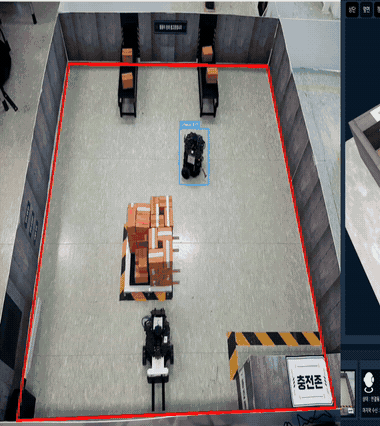
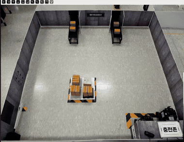

# SLAM & Navigation — 자율주행 파트

TurtleBot3 3대로 물류센터를 무인 순찰하는 자율주행 스택입니다.
순찰, 이벤트 출동(증거 촬영), 자동 충전·2대 교대, 지게차 운반까지 로봇 쪽 주행 전부를 담당합니다.

담당: 김애리

<p align="center">
  
  <br><em>자동 충전 도킹 — 반복 정밀도 ±2mm, 진입각 -0.23°</em>
</p>

## 최종 성과

| 항목 | 결과 | 비고 |
|---|---|---|
| 주행 성공률 | 30% → **100%** | 원인은 주행 코드가 아니라 시간동기(chrony) |
| 도킹 반복 정밀도 | **±2mm** / 진입각 -0.23° | ArUco 접근 + 라이다 벽피팅 자세 + 라이다 절대거리 |
| 금지구역 침범 | **0건** | KeepoutFilter + 자작 침범 감시 노드로 실기 검증 |
| 2대 자동 교대 | 개입 0회 | 1랩 = 1교대, 배터리 33%/85% 정책 |
| 검증 체크리스트 | 45항목 구현·검증 | 파트 간 인터페이스 계약 v1.4 기준 |

<p align="center">
  
  <br><em>충전 교대 — 근접 경보(0.33m) 속에 교차하며 한 대는 충전존으로, 한 대는 순찰 인계</em>
</p>

<p align="center">
  
  <br><em>정상 순찰 풀랩 → 충전 복귀 (10배속)</em>
</p>

## 시스템 구성

```
Cartographer(SLAM) → AMCL(위치추정) → NavFn + RPP(경로계획·조향)
                                          │
                     patrol_commander (20상태 FSM) ← 서버/관제 명령
                                          │
              순찰 · 이벤트 출동 · 충전 복귀 · E-STOP · 교대
```

- 지도: 실측 1.8×1.8m 창고 맵, 5cm 격자(52×52), 복도 폭 약 40cm
- 미션 제어: `patrol_commander` 20상태 FSM (순찰/파견/충전/비상 전 상태가 한 관문을 지나도록 설계)
- 로봇↔서버↔관제 인터페이스: `teamproject_interfaces` 계약 v1.4
- 통신: CycloneDDS, 로봇별 도메인 분리(97/88/4)로 명령·센서 혼선 차단

## 로봇 3대 역할

| 호기 | 역할 | 핵심 기능 |
|---|---|---|
| 1호기 | 메인 순찰·이벤트 출동 | Waypoint 순찰, 위험 감지 시 현장 출동·증거 촬영 |
| 2호기 | 대기·충전 교대 | 1호기 충전 시 순찰 인계, 배터리 기준 복귀/재출발 |
| 3호기 | 지게차·물품 운반 | 랙앤피니언 리프트, 관제 수동조작 연동 |

## 폴더 구조

```
slam_navigation/
├── src/
│   ├── teamproject_navigation/   # 순찰 FSM·launch·waypoint (ROS2 패키지)
│   └── teamproject_interfaces/   # 파트 간 msg/srv 계약 v1.4
├── docking/                      # ArUco 정밀 도킹, 이벤트 융합, 금지구역 감시
├── pi/                           # 로봇(RPi) 탑재 노드 — 도킹 실행기, UDP 카메라 센더
├── scripts/                      # 기동/정지 운영 스크립트 (CLEAN_START 계열)
├── maps/                         # 맵, 금지구역 마스크, 순찰 그래프
├── calib/                        # 카메라 캘리브레이션 결과 (fx/cx가 도킹 정밀도를 좌우)
└── docs/                         # 문제 해결 기록, 데모 이미지
```

## 실행 방법

PC(주행 스택)와 로봇(RPi, 센서·모터·카메라)으로 나뉩니다.

```bash
# 1. 빌드
cd ~/team_ws && colcon build --packages-select teamproject_interfaces teamproject_navigation

# 2. 로봇 기동 (RPi) — pi/robot_bringup.launch.py.TEMPLATE 참고

# 3. PC 스택 기동 — Nav2·도킹·융합 노드를 순차 게이트로 올림
./scripts/CLEAN_START.sh        # 1호기
./scripts/CLEAN_START_R2.sh     # 2호기 (도메인 88)

# 4. 순찰 시작
ros2 service call /robot1/set_mode teamproject_interfaces/srv/SetMode "{mode: 'PATROL_START'}"
```

노드 재시작 시 반드시 `CLEAN_START`를 사용합니다. 중복 프로세스가 목표를 서로 취소해
주행이 붕괴하는 사고를 겪은 뒤, 이전 인스턴스 정리 → Nav2 전체 active 확인 → 카메라 순으로
게이트를 두고 올리도록 만들었습니다.

## 핵심 파라미터

| 파라미터 | 기본값 | 설명 |
|---|---|---|
| `use_route_servo` | true | 순찰 주행을 서보 루트로 (이벤트 접근은 Nav2 회피) |
| `use_nav2_event_approach` | true | 이벤트 접근을 Nav2로 — 장애물 회피 |
| `use_clear_detour` | true | 막힘 5초 확정 시 자율 우회 |
| `wall_yaw_offset_deg` | 로봇별 | 라이다 장착각 보정 (로봇2 비틀림 5° 해결) |
| `servo_standoff` | 0.734 | 도킹 마커 스탠드오프 (실측값) |
| `battery_threshold` | 33.0 | 충전 복귀 판단 기준 (%) |

## 설계에서 지킨 것

- **안전은 관문에서 강제한다** — E-STOP은 상태 전환이 지나가는 한 곳(`change_state`)에서 래치.
  관제의 명시적 해제 없이는 어떤 코드도 풀 수 없다. 스캔 두절 감시, 수동조작 데드맨(0.5s)도 같은 원칙.
- **한 제어루프에 두 기준을 섞지 않는다** — 도킹에서 벽 기준과 카메라 기준을 교대로 쓰면 진동한다.
  단계마다 기준 하나(접근=마커, 자세=벽피팅, 깊이=라이다 절대거리)만 사용.
- **타임아웃은 유도식으로** — 속도를 바꾸면 그 속도에 묶인 하드코딩 타임아웃이 깨진다. 전부 거리/속도 유도식으로 전환.
- **추측 대신 측정** — 성공률 30%의 원인 후보 다섯을 수치로 하나씩 소거했다. 과정은 아래 문서에.

문제 해결 과정 전체 기록: [docs/troubleshooting.md](docs/troubleshooting.md)
